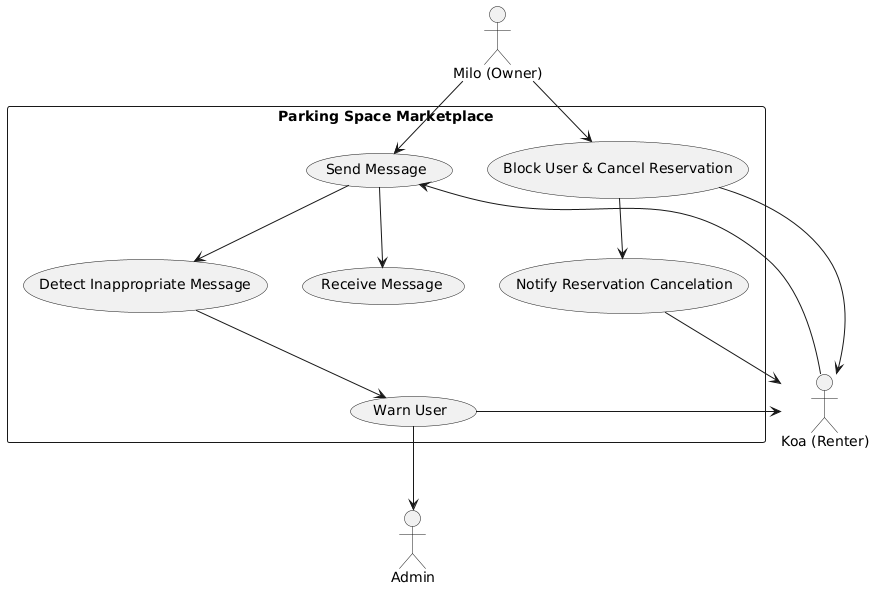
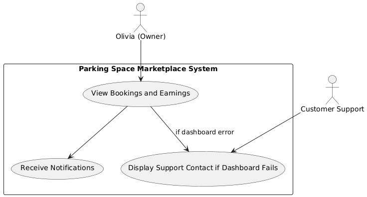
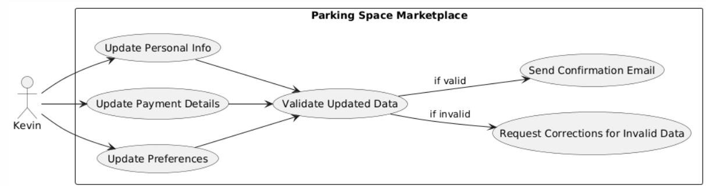
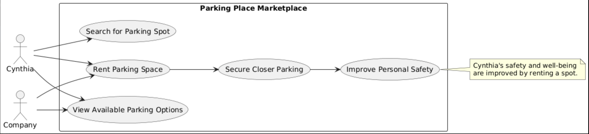
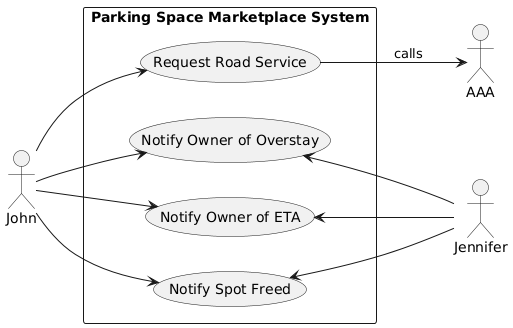

# SW Engineering CSC648-848-05 Summer 2025, T05: Parking Space Marketplace
# Milestone 1 V1

## Project/Application Title: Parking Space Marketplace

**Date:**June 17th 2025

---

### History Table

| Milestone | Version | Date |
| ---       | ---     | ---  |
| M1        | V1      |  June 17th 2025    |

---

### Table of Contents

1. [Executive Summary](#executive-summary)  
2. [Team](#team)  
3. [Main Use Cases](#main-use-cases)  
4. [Main Data Items and Entities](#main-data-items-and-entities)  
5. [Functional Requirements](#functional-requirements)  
6. [Non-Functional Requirements](#non-functional-requirements)  
7. [Competitive Analysis](#competitive-analysis)  
8. [Checklist](#checklist)  
9. [High-Level System Architecture and Technologies Used](#high-level-system-architecture-and-technologies-used)  
10. [List of Team Contributions](#list-of-team-contributions)  

---

## Team

| Student | Full Name             | SFSU Email             | GitHub Username      | Discord Username      | Role(s)                      |
|:-------:|:---------------------:|:----------------------:|:--------------------:|:---------------------:|:-----------------------------:|
|    #1   | Stella Parker         | sparker11@sfsu.edu     | @whoIsStella         | latchkeykid           | Team-lead / Backend-Lead/GitHub Master/Scrum Master |
|    #3   | Nathaniel Moreno      | nmoreno@sfsu.edu       | @NateM03             | ba_daniels            | Database Administrator        |
|    #4   | Fatma Almosawi        | falmosawi@sfsu.edu     | @fatma-al            | fatma.almosawi        | Scrum Master                  |
|    #5   | Krishna Shenoy        | 920875953@sfsu.edu     | @krishs44            | krishnashenoy_71520   | Technical Writer              |
|    #6   | Juan Daniel Ramirez   | jramirez9@sfsu.edu     | @JuanDanielRamirez   | juanramirez_05991     | Frontend Lead                 |
|    #7   | Julianna Embalzado    | eembalzado@mail.sfsu.edu | julianna-embalzado | jejemon6201           | Software Architect            |

---

## Executive Summary

Parking in cities is a daily headache for millions, wasting time, fuel, and patience as drivers circle blocks searching for spots. Meanwhile, countless private parking spaces sit empty and unused. Parking Space Marketplace bridges this gap by creating a vibrant, community driven platform where anyone can list or discover parking spaces for short term use.

With Parking Space Marketplace, drivers can easily find available parking in their area, while property owners earn extra income by sharing their unused spots. Our platform offers reliable search, transparent pricing, and a user friendly experience that builds trust between drivers and space owners. By enabling better use of existing spaces, Parking Space Marketplace makes parking smarter, more affordable, and more convenient for everyone.

---

## Main Use Cases

### Use Case 1: List a Parking Space
Owner uploads info, sets price, and posts availability. If the info is incomplete, app prompts for missing data.

**Actors:** Macy (apartment resident), Parking Space Marketspace (company)

**Assumptions:**
- Macy has a phone and access to the internet.
- Macy has parking space she does not use often.
- Macy has a parking space that intrests renters. 

**Use Case:**
Macy has been living in the city for a while now. As such, she has found her way to move around without the need for a car. Recently, Macy decided to get rid of some junk she had in her parking garage but is unsure of what to fill the space with. She does not want to leave it empty, as she believes that would be a waste of space. She surfs the web, looking for ideas or inspiration as to what to fill the garage with. During this search, Macy comes across the Parking Space Marketspace. Out of curiosity, she looks around the site and quickly finds out that she can sell her garage to people. She considers how many places of interest are near her home, specifically a park that is usually filled with lots of people, and so she decides to register her spot into the website. Not only has Macy figured out what to do with the garage, but she can earn some money on the side as well. The application makes it easy for her to list her parking space and change the price and when it is available for renters. 

**Benefits:**
- Macy can set her price for the parking spot, allowing her to earn more money.
- Macy can decide when her garage is available, which allows her to plan ahead.
- Macy can if needed update her listing, making sure her parking space will be looked at for customers wanting to rent. 

**Use Case Modeling:**

### Use Case 2: List a Parking Space
Renter enters location, desired time; app shows nearby available spots on a map. If no spaces found, app suggests adjusting filters or dates.

**Actors:** Bob (student), Josh (Bob’s friend), Parking Space Marketspace (company)

**Assumptions:**
- Bob has access to a phone and owns a car.
- Bob is aware of when and where he wants the desired parking place.
- Bob is able to pay for this service. 

**Use Case:**
Bob has made his class schedule for next semester. He has classes every Tuesday and Thursday starting with Biology at 11:00 am. While Bob is excited to take Biology, he is also worried that there will not be any parking spaces left at that time. Bob asks his friend John for help. John suggests arriving at an earlier time to claim a parking spot, but Bob rejects the idea. He cannot arrive at the campus at an earlier time. Josh then suggests that Bob could take the class at another time to make sure he does not arrive late, but Bob explains that all other class times are full. Josh thinks for a moment before recommending Parking Space Marketplace. Bob decides to take a look at the website, despite never hearing about it. After filling in the location of his university, the site shows him some nearby spaces available. He notices one that is pretty close to his Biology class and checks to see when he can claim the space. Luckily, he can reserve the spot up until his last class and for the entire semester. Bob can now look forward to taking Biology, especially with a guarantee that he will not be late due to parking.

**Benefits:**
- Bob can reserve a spot in advance and for how long, allowing him to plan ahead.
- Bob can choose a location to find nearby spots, giving him more freedom.
- Bob will save time as well as minimize the stress that comes with finding a parking space. 
- Bob can find a parking space in his price range. 

**Use Case Modeling:**

### Use Case 3:
Renter selects a spot, reviews details, and confirms booking. If payment fails, app prompts renter to retry or choose a different method.

**Actors:** Richard (Customer/User), Parking Space MarketSpace (Company)

**Assumptions:**

- Richard is a busy lawyer who frequently travels to the city for work.
- Richard already uses the Parking Space MarketSpace app.
- Richard relies on his default card payment for his payment method.

**Use Case:**

Richard is a busy lawyer who travels frequently to the city for work. He already uses the Parking Space Marketspace app to find parking spots in the city, as it is hard for him to find a parking spot that is next to his office building. To give Richard peace of mind when booking the parking space, he has already saved his card as a default card payment every time he books a parking space. Usually, it gives him a confirmation that the spot has been successfully booked. Unfortunately, Richard didn’t realize that the default card payment he has booked has already been expired. When Richard booked the usual parking spot that he usually goes for, the app gave him a notification that his card has already been expired so it cannot process the transaction. It prompted Richard to put a new card on file or to try it again. To make it easier for Richard, the app gave him an option to capture the image of his card, and it would fill up his information or he could write his information down manually. After choosing the first option, the app later on asked if he would like this new card to be his default card payment on file in which Richard opted in for. After fixing the payment issue, Richard proceeded to book his usual parking spot successfully giving him confirmation regarding the reservation as well as the information for the parking space to answer any questions the customer could have. 

**Benefits:**

- Richard has security that his payment went through, and his booking was successful with a confirmation
- Efficiency and convenience with booking because of the saved card payment information.
- Richard has security and peace of mind regarding why the issue arises with his payment method.

**Use Case Modeling:**Renter selects a spot, reviews details, and confirms booking. If payment fails, app prompts renter to retry or choose a different method.

**Actors:** Richard (Customer/User), Parking Space MarketSpace (Company)

**Assumptions:**

- Richard is a busy lawyer who frequently travels to the city for work.
- Richard already uses the Parking Space MarketSpace app.
- Richard relies on his default card payment for his payment method.

**Use Case:**

Richard is a busy lawyer who travels frequently to the city for work. He already uses the Parking Space Marketspace app to find parking spots in the city, as it is hard for him to find a parking spot that is next to his office building. To give Richard peace of mind when booking the parking space, he has already saved his card as a default card payment every time he books a parking space. Usually, it gives him a confirmation that the spot has been successfully booked. Unfortunately, Richard didn’t realize that the default card payment he has booked has already been expired. When Richard booked the usual parking spot that he usually goes for, the app gave him a notification that his card has already been expired so it cannot process the transaction. It prompted Richard to put a new card on file or to try it again. To make it easier for Richard, the app gave him an option to capture the image of his card, and it would fill up his information or he could write his information down manually. After choosing the first option, the app later on asked if he would like this new card to be his default card payment on file in which Richard opted in for. After fixing the payment issue, Richard proceeded to book his usual parking spot successfully giving him confirmation regarding the reservation.

**Benefits:**

- Richard has security that his payment went through, and his booking was successful.
- Efficiency and convenience with booking because of the saved card payment information.
- Richard has security and peace of mind regarding why the issue arises with his payment method.

**Use Case Modeling:**

### Use Case 4: Cancel a Booking

- **Description:**

  Renter or owner cancels before start time; system notifies the other party. If cancellation is too close to start, app enforces cancellation policy.

- **Actors:**

  Leo (spot/owner), Derek (customer/renter), Parking Space Marketspace

- **Assumptions:**

  - Either party can choose to cancel before the reservation start time
  - The cancellation policies are in place and have been agreed upon.

- **Use Case:**

  Leo just realizes that he will not be able to use his driveway for the upcoming reservation as it will be inaccessible due to construction going on. He needs to cancel the reservation before the time that it starts, so he logs into the app and finds his active booking to cancel it. Derek the spot renter is immediately notified and receives a full refund since he was not the one to cancel and the cancellation happened 24 hours in advance. The app then provides Derek with suggested alternative parking spaces around the same area.

- **Benefits:**

  - Provides flexibility for both parties/users
  - Handles refunds and re-bookings to make it simple and easy
  - Nofications will be sent to both of the parties for communication. 

**Use Case Modeling:**

### Use Case 5:
Renter and owner communicate about arrival or specific instructions. If inappropriate messages are detected, admin is alerted.

**Actors:**  Koa (Renter), Milo (Owner), Parking Space MarketSpace (Company/admin)

**Assumptions:**

- Koa rented Milo’s parking space from 1:30 - 2:30 PM on the Parking Space MarketSpace (Company)
- Milo has been using Parking Space MarketSpace to rent out his parking space and his parking space is in a popular area, as it is in the city and close to businesses that people usually go to
- Users have the option to message each other. 
- The app has language moderation to make sure users have a postive expierence. 

**Use Case:**

Koa is visiting the city to run some errands and found that Milo’s spot is close to the places that he needs to go to. Koa saw that the only time that his space is available is from 1:30 - 2:30 PM. Koa booked for that time slot but decided to come early to hopefully finish his errands earlier without telling Milo. Koa also received specific instructions to arrive on the time slot booked. Koa came at around 12:00 PM to the parking spot only to find out that it has been taken by another car. Koa contacted Milo saying he is here for the 1:30 - 2:30 parking spot appointment. Milo told Koa that the parking spot has already been booked by someone from 11:00 AM - 1:00 PM. Koa insisted that Milo can accommodate his situation since he came a long way from home to get into the city. Milo insisted that he cannot kick out guest who are already in the spot and who have booked it for that time slot. This made Koa mad since Milo could not accommodate to his requests and started cussing Milo out in the chat. Koa even made death threats towards Milo and said he is going to sue Milo for wasting his time. The admin got alerted to the inappropriate message that Koa was saying in the chat and gave a warning on Koa’s side that inappropriate messages are not allowed and could lead to his account being banned or suspended. On Milo’s side it gave him an option to block Koa and cancel his reservation. Milo not wanting to deal with Koa, he opted to block Koa and cancel his reservation. After Milo selected this option, Koa isn’t allowed to message Milo anymore as well as a notification saying his reservation has been canceled. There will be evidence about this interaction. 

**Benefits:**

- Koa received specific instructions regarding the reservation, including the time slot of when his reservation starts. Koa has the privilege to message Milo regarding the reservation and vice versa, allowing issues to be addressed directly with the owner.
- Koa is given the chance to correct his behavior, letting him realize that his behavior is inappropriate towards Milo because of the warning given to him and the consequences given to him.
- Milo has the protection to not tolerate the inappropriate behavior that Koa has displayed by giving him an option to block and cancel Koa’s reservation.

Renter and owner communicate about arrival or specific instructions. If inappropriate messages are detected, admin is alerted.

**Actors:**  Koa (Renter), Milo (Owner), Parking Space MarketSpace (Company/admin)

**Assumptions:**

- Koa rented Milo’s parking space from 1:30 - 2:30 PM on the Parking Space MarketSpace (Company)
- Milo has been using Parking Space MarketSpace to rent out his parking space and his parking space is in a popular area, as it is in the city and close to businesses that people usually go to

**Use Case:**

Koa is visiting the city to run some errands and found that Milo’s spot is close to the places that he needs to go to. Koa saw that the only time that his space is available is from 1:30 - 2:30 PM. Koa booked for that time slot but decided to come early to hopefully finish his errands earlier without telling Milo. Koa also received specific instructions to arrive on the time slot booked. Koa came at around 12:00 PM to the parking spot only to find out that it has been taken by another car. Koa contacted Milo saying he is here for the 1:30 - 2:30 parking spot appointment. Milo told Koa that the parking spot has already been booked by someone from 11:00 AM - 1:00 PM. Koa insisted that Milo can accommodate his situation since he came a long way from home to get into the city. Milo insisted that he cannot kick out guest who are already in the spot and who have booked it for that time slot. This made Koa mad since Milo could not accommodate to his requests and started cussing Milo out in the chat. Koa even made death threats towards Milo and said he is going to sue Milo for wasting his time. The admin got alerted to the inappropriate message that Koa was saying in the chat and gave a warning on Koa’s side that inappropriate messages are not allowed and could lead to his account being banned or suspended. On Milo’s side it gave him an option to block Koa and cancel his reservation. Milo not wanting to deal with Koa, he opted to block Koa and cancel his reservation. After Milo selected this option, Koa isn’t allowed to message Milo anymore as well as a notification saying his reservation has been canceled. 

**Benefits:**

- Koa received specific instructions regarding the reservation, including the time slot of when his reservation starts. Koa has the privilege to message Milo regarding the reservation and vice versa, allowing issues to be addressed directly with the owner.
- Koa is given the chance to correct his behavior, letting him realize that his behavior is inappropriate towards Milo because of the warning given to him and the consequences given to him.
- Milo has the protection to not tolerate the inappropriate behavior that Koa has displayed by giving him an option to block and cancel Koa’s reservation.

**Use Case Modeling:**

### Use Case 6: Owner Reviews Bookings and Earnings

- **Description:**  

  Owner checks upcoming/past bookings and income dashboard. If dashboard fails to load, app displays support contact.

- **Actors:**
   Olivia (Owner), Parking Space Marketplace System, Customer Support 

- **Assumptions:**  

  - Olivia has an active account with permission to view booking and payment data.  
  - The system is operational, and Olivia has a reliable internet connection.  
 
- **Use Case:**  

  Olivia, the parking space owner, logs into the Parking Space Marketplace app and navigates to her dashboard, which displays a clear summary of all upcoming and past bookings for her parking spaces. The dashboard also provides detailed earnings reports over various timeframes, enabling Olivia to track income and analyze trends. She can filter bookings by date, status, or location, making it easy to manage multiple listings. If the dashboard fails to load, the app immediately shows contact information for customer support, so Olivia can quickly get assistance. Olivia uses this information to stay informed about her rental activity and make informed decisions regarding availability and pricing. Notifications about new bookings, cancellations, and completed rentals help keep Olivia up to date without constantly checking the app.

- **Benefits:**  

  - Provides Olivia with transparent and real-time information on bookings and earnings.  
  - Offers prompt support access in case of technical issues, enhancing user confidence and satisfaction.

**Use Case Modeling:**

### Use Case 7: User Profile Management

- **Description:**

  User updates personal info, payment details, or preferences. If invalid info is entered, app requests corrections.

- **Actors:**
   Kevin (User/Renter), Parking Space Marketspace System 

- **Assumptions:**  

  - Kevin is logged into a verified account
  - The system validates and stores updated data securely
  - Kevin can make changes to personal information and payment details.   
 
- **Use Case:**  

  Kevin just sold his house and is moving into a new home, and bought a new car as well. To make sure his account is still active and accurate, he logs into the app and goes to his profile settings. He then updates his home address, car license plate, and adds a new credit card as well for future payments. The system validates his card and securely updates his profile. Kevin then receives a confirmation email summarizing the changes, and now his account is ready to go again. This makes sure there will be no mix-ups with wrong information between the user and the renter.

- **Benefits:**  

  - Keeps user data accurate and secure  
  - Allows easy booking and ensures users' info is accurate and trustworthy
  - Kevin can stay connected to Parking Space Marketplace and make changes (changing address)

**Use Case Modeling:**

### Use case 8:

- **Actors:** Cynthia (Customer), Parking Space Marketspace System (Company)

- **Assumptions:** 

    - Cynthia owns or has access to a car
    - Cynthia works night shifts
    - Cynthia lives in a neighborhood with a concerning crime rate 

- **Use Case:**

  Cynthia, who works night shifts, resides in a neighborhood with a high crime rate. Upon returning home from her shifts in the middle of the night, she consistently encounters difficulties in finding parking. The available parking spaces are often situated at considerable distances, necessitating lengthy walks back to her residence. This situation poses a significant safety concern for Cynthia, especially considering the prevalent news reports of violence against women in her area. To address this issue, Cynthia explored the possibility of securing a parking space closer to her home. She discovered that one of her neighbors had an unused parking spot that she could rent. This discovery brought her immense relief and satisfaction, as it eliminated the fear of unsafely returning home each night from work. Cynthia promptly rented the parking space using the application (Parking Place Marketplace) and experienced a profound sense of comfort upon returning home from work. This newfound convenience has significantly improved her overall well-being.
   
- **Benefits:** 

  - Cynthia no longer needs to live in fear each night she comes home from work.
  - Cynthia has a lower chance of any violence or crime committed to her.

**Use Case Modeling:**
 

#### Use case 9:

- **Actors:** Margaret (Customer), Parking Space Marketspace System (Company)

- **Assumptions:**

  - Margaret has a car
  - Margaret has health concerns (mobility impairment)
  - There is limited street parking where she lives

- **Use Case:**

    Margaret, an elderly customer with a mobility impairment, faces significant challenges in accessing her residence due to the limited street parking availability in her vicinity. The extended distances required to find parking near her home exacerbate her health condition, rendering walking an impractical option. Consequently, she has been confined to her home, avoiding the inconvenience and potential strain associated with long-distance walks. However, upon discovering the availability of a convenient parking spot on our website, Margaret has taken proactive steps to secure it. This arrangement has alleviated her concerns, enabling her to leave her home without the burden of excessive walking, particularly given her health limitations. By having a readily accessible parking space, Margaret can now freely engage in outdoor activities and enjoy life without the constraints of long-distance transportation.

- **Benefits:**

  - Margaret gets to leave the house more because she knows there will be parking for her. 
  - Accessibility 
  - Minimizes stress 

**Use Case Modeling:**

### Use Case 10: Car trouble in currently rented parking space

- **Actors:** John (Customer), Jennifer (Parking spot owner), Parking Space Marketplace, AAA (Tow service + road services)

- **Assumptions:**

  - John has a car and is occupying Jennifer's parking space
  - John's car will not start because of cold weather 
  - Parking Space Marketplace has AAA (road service) help 

- **Use Case:**

  John is currently renting Jennifer's parking spot using Parking Space Marketplace. He is in a business meeting, and when he gets back to his car he discovers that the cold weather killed his battery. The time before John has to give up his parking space for the next customer is 10 minutes away. John logs onto the application and chooses "road service" option. After charging John's credit card for the late stay in the parking spot, Parking Space Marketplace connects John to AAA (road service) so he can let them know of the dead battery and they can send someone to jump it, then the application lets Jennifer know that John will be occupying the parking spot longer than intended because of car trouble. It will also let Jennifer know the road service arrival time and will notify her when the parking spot is free after road service is done helping John with his vehicle. 

- **Benefits:**
  - John can get road service (car trouble help) using Parking Space Marketplace
  - Jennifer is kept in the loop about the overstay on her property

**Use Case Modeling:**

---

## Main Data Items and Entities

| Entity        | Meaning/Definition                              | Usage                                              |
| ------------- | ----------------------------------------------- | -------------------------------------------------- |
| **User**      | Registered person (owner/renter/admin)          | Auth, permissions, booking, reviews                |
| **ParkingSpace** | An individual spot listed                 | Search, map display, availability management       |
| **Booking**   | Record of reservation for a time period         | Payment, availability locking, history             |
| **Payment**   | Transaction between renter and owner            | Track status, refunds, fees                        |
| **Message**   | In-app communication between users              | Coordination, support, moderation                  |
| **Review**    | Post-booking feedback/rating                    | Community trust, quality control                   |
| **AdminAction** | Actions by admins (e.g., ban, refund, dispute) | Platform safety and dispute resolution             |

---

## Functional Requirements

### For Renters/Drivers

1. Search by address, date, time
2. Interactive map view of spots
3. Filter by price, distance, type
4. Filter by vehicle size compatibility
5. Filter by amenities (e.g., EV charging, covered)
6. Sort search results by relevance, price, distance
7. View detailed spot information (photos, description, rules)
8. Book spots online
9. Pay for spots online (multiple methods)
10. Cancel bookings (with refund policies)
11. View upcoming bookings
12. View past bookings
13. Leave reviews for owners/spots
14. Manage profile information
15. Manage payment methods
16. Receive booking reminders (email/SMS)
17. Message owners directly
18. Get navigation to spot
19. Extend current booking
20. Report parking spot issues

### For Owners

1. List new space (address, photos, description)
2. Set custom availability windows
3. Define pricing (hourly, daily, weekly)
4. Edit existing listings
5. Remove existing listings
6. View booking calendar
7. Receive booking notifications
8. Accept booking requests
9. Decline booking requests
10. Receive payouts to bank account
11. View earnings dashboard
12. Respond to renter messages
13. Review renters
14. Update profile details
15. Update banking information
16. Set parking spot rules
17. Temporarily unlist a spot

### For Admin

1. Manage user accounts (renters/owners)
2. View all bookings
3. View all payments and transactions
4. Monitor user-generated content (reviews, listings)
5. Flag inappropriate content
6. Handle disputes between users
7. Process user reports
8. Issue refunds
9. Apply penalties (e.g., suspension)
10. Update platform terms and conditions
11. Adjust platform settings (e.g., commission rates)
12. View analytics and usage metrics
13. Monitor system health and performance
14. Suspend user accounts
15. Ban user accounts
16. Generate financial reports

### For All Users

1. Register for an account
2. Log in securely
3. Reset password functionality
4. Manage notification preferences
5. Access help center/FAQ
6. Contact customer support
7. View privacy policy
8. View terms of service
9. Delete account
---

## Non-Functional Requirements

### 1. Performance  
- The system shall support many users at the same time without slowing down.   
- Page load times shall not exceed 3 seconds under typical network conditions.  
- Search operations for parking availability must return results within 2 seconds.

### 2. Reliability  
- All booking transactions shall be atomic and consistent to prevent race conditions and double-bookings.  
- Automated daily backups and disaster recovery plans shall be implemented to ensure data integrity.

### 3. Security  
- Sensitive data, including payment details, shall be encrypted in transit using TLS 1.2+ and at rest using AES-256 or stronger.  
- Role-Based Access Control (RBAC) shall enforce permission separation between users, owners, and admins.  
- Payment processing shall comply with PCI DSS requirements.

### 4. Usability  
- The user interface shall conform to WCAG 2.1 Level AA accessibility guidelines.  
- The platform shall provide a responsive design supporting desktop, tablet, and mobile devices.  
- Onboarding flows shall include contextual help and tooltips for first-time users.

### 5. Maintainability  
- Continuous integration and deployment pipelines shall be configured to enforce quality gates.

### 6. Portability  
- The application shall support deployment on major operating systems (Windows, macOS, Linux) for admin interfaces.  
- Frontend shall be compatible with iOS and Android browsers; native apps may be considered.  

### 7. Scalability  
- The system architecture shall support horizontal scaling at the application and database layers.  
- Data storage and indexing solutions shall maintain performance as data volume increases.

### 8. Compatibility  
- The platform shall support the two most recent major releases of Chrome, Firefox, Safari, and Edge browsers.  
- Integration with third-party services (payment gateways, map APIs) shall allow independent version upgrades without downtime.

### 9. Compliance  
- The system shall comply with GDPR, CCPA, and other applicable data protection laws.  
- Accessibility and anti-discrimination legislation shall be adhered to throughout UI/UX design.

### 10. Supportability  
- Monitoring tools shall provide real-time alerts for system failures and performance degradation.  
- Support teams shall have access to diagnostic logs and user activity reports via a dedicated admin dashboard.  
- Incident management procedures shall be clearly defined and regularly reviewed.

### 11. Coding Standards  
- All source code shall conform to the team's style guides.  
- Pull requests must receive peer review before merging.

---

## Competivie Analysis:

### Important Features Table:

| Features/Companies | Spacer | SpotHero | Park Mobile | AirGarage | YourParkingSpace |
| --- | --- | --- | --- | --- | --- |
| Strengths | The top cities of the US are covered | Real time inventory | Public-private event partnerships | Automates entire operations | Offers long-term options |
| Weaknesses | Only buy a space monthly | Only available in North America | Less flexibility when it comes from peer to peer | Audience is focused on Institutional owners | UK-centric |
| Pricing | Variable | Event based pricing | Small convenience fees for mobile use | No upfront cost for owners | Subscription plans for regular users |
| Social Media | Instagram, Twitter, and Facebook | Instagram, twitter, linkedIn. Event based contents | Instagram, Twitter, LinkedIn | None except for LinkedIn and Instagram | UK-specific campaign |
| Onboarding Experience | Easy to understand instructions | Fast email and social media login | Utility focused  | Targets lot owners specifically | Sign-up is complicated and onboarding tailored to specific location |
| Links  | [https://www.spacer.com](https://www.spacer.com/) | [https://spothero.com](https://spothero.com/) | https://parkmobile.io/ | https://www.airgarage.com/ | https://www.yourparkingspace.co.uk/ |

### High-level Comparison:  

| Features/Companies | Parking Space Marketspace | Spacer | SpotHero | Park Mobile | AirGarage | YourParkingSpace |
| --- | --- | --- | --- | --- | --- | --- |
| Real-time booking | ✅ | ⚠️  | ✅ | ✅ | ✅ | ✅ |
| Peer-to-peer listings  | ✅ | ✅ | ❌ | ❌ | ❌ | ✅ |
| EV charging support | ✅ | ⚠️  | ⚠️ | ⚠️ | ✅ | ✅ |
| Recurring/long-term booking | ✅ | ✅ | ❌ | ❌ | ✅ | ✅ |
| Vehicle License Insurance | ✅ | ✅ | ❌ | ❌ | ❌ | ❌ |

⚠️ = Minimally Supported
✅ = Supported
❌ = Not Supported

While our idea is not new to the market, our service will have multiple advantages over the competition. Aside from providing the features
mentioned in the high level comparison, our major competitive edge is giving the user complete freedom. The four companies mentioned above 
all enact limitations on how their users can park. Park Mobile allows their users to chose how long they wish to park, however, they can 
only park for at most a day. YourParkingSpace gives their users more freedom than Park Mobile, but it still limits them for at most three 
days parking. Then there are SpotHero and Spacer, which have the opposite problem, as they only allow monthly parking. As for AirGarage,
their service depends on their partners, which are usually parking lots or parking garages, so they are probably limited to daily parking.
While these services are nice, they fail to solve all problems involving parking. what if there is a student who has class from 12:00 to 3:00
Every Tuesday and Thursday? There is no easy way for them to guarantee a parking spot for an entire semester. That is, without our service.
In other words, our service will handle the more specific scenarios that remain unresolved, or require a difficult solution, by giving more
flexibility to the user. No daily limit, no monthly limit, just complete freedom to register at specific times for some duration, on top of
what the comptetion already provides.

## Checklist

- [x] Found a time slot outside of class? DONE 
- [x] GitHub master branch chosen? DONE  
- [x] Team selected frameworks & deployment server? DONE  
- [x] Everyone read M1 spec? DONE
- [x] GitHub repo organized per class guidelines? DONE  

---

## High-Level System Architecture and Technologies Used

- **Server:** AWS EC2  
- **Operating Systems:** Windows 11, Linux Mint, macOS  
- **Database:** PostgreSQL  
- **Web Server:** Caddy  
- **Backend Language:** Python  
- **Backend Framework:** Django  
- **Frontend Language:** JavaScript (React), CSS, HTML  
- **Frontend Framework:** Next.js  
- **Additional Tech:** WSL, Poetry, npm/Yarn 
- **IDE:** Visual Studio Code, DBeaver  
- **SSL Certificate:** Caddy (automatic HTTPS via Let’s Encrypt)  
- **Containerization:** Docker (running on EC2)  

---

| Team Member | Contributions                                                                                                                             |
|-------------|--------------------------------------------------------------------------------------------------------------------------------------------|
| Nathan      | - Wrote Use Cases 4 & 7 - Created UML diagram for Use Case 7 - Set up basic PostgreSQL database - Updated personal info          |
| El          | - Wrote Use Cases 3 & 5 - Conducted competitive analysis for SpotHero, ParkMobile, AirGarage, YourParkingSpace - Created high-level comparison table with features (real-time booking, peer-to-peer, EV charging, recurring long-term, vehicle/license insurance) - Added bio & picture                          |
| Krishna     | - Added bio & picture (pushed to dev branch) - Improved styling across pages - Wrote Use Case 10 - Expanded sentences in other use cases - Enhanced frontend aesthetics and visual design |
| Juan        | - Wrote Use Cases 1 & 2 - Filled “Spacer” column in important features & high-level comparison tables - Drafted paragraph on product’s competitive edge |
| Stella      | - Served as Team Lead - Created backend AWS infrastructure -  Set up `credentials` folder with SSH & DB config - Implemented core frontend functionality  - Implemented core backend functionality  - Added Use Case 6  - Created 9/10 Use case diagrams
| Fatma       | - Contributed to Milestone 1 deliverables - Added informational content to the About page  - Added Use Case 9 & 10                                                |

---

