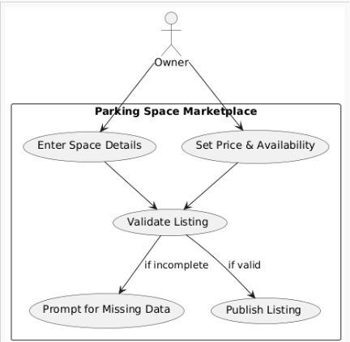
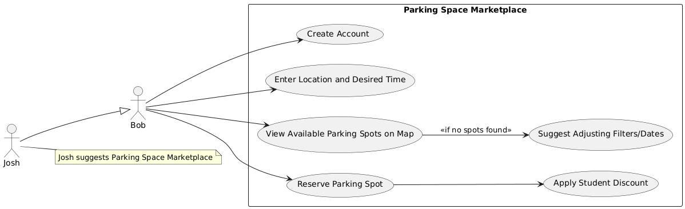
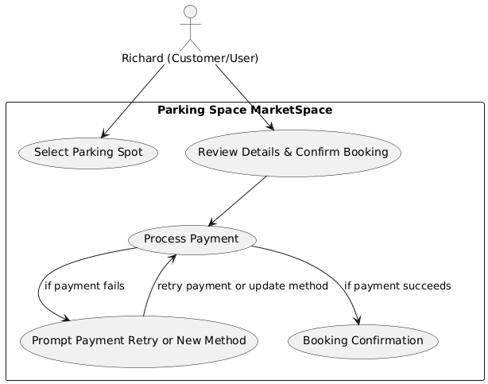
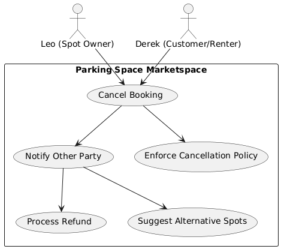
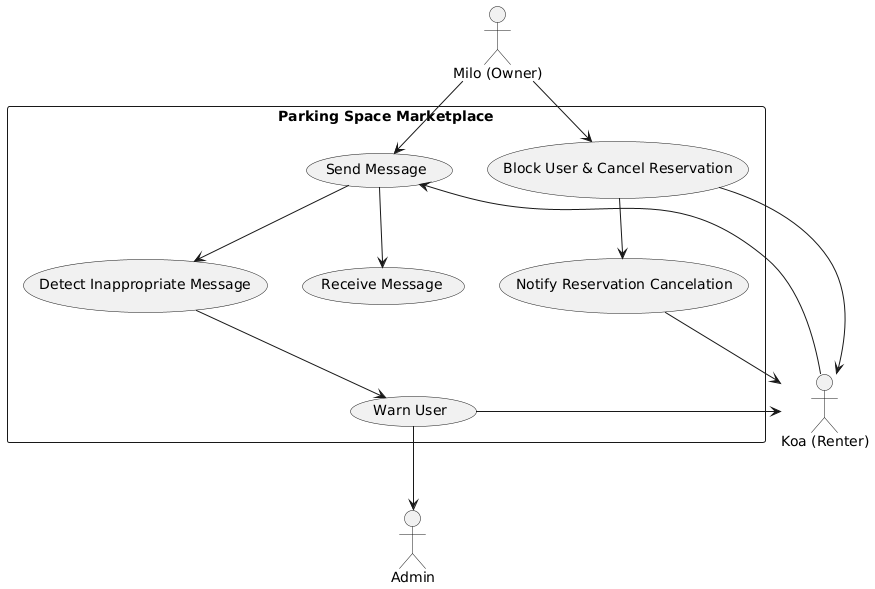
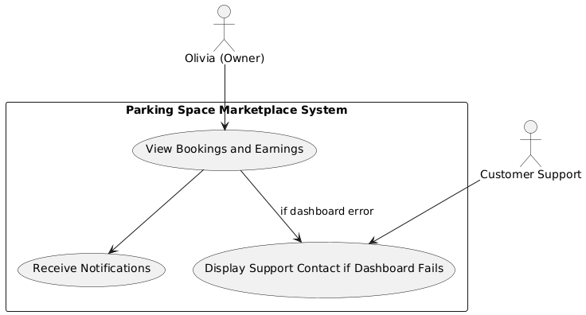
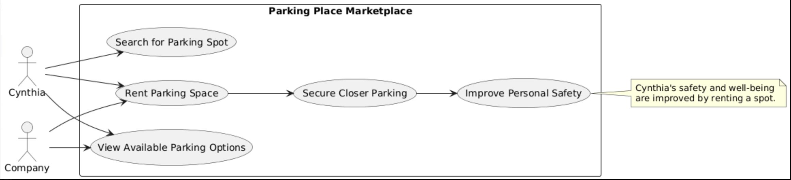
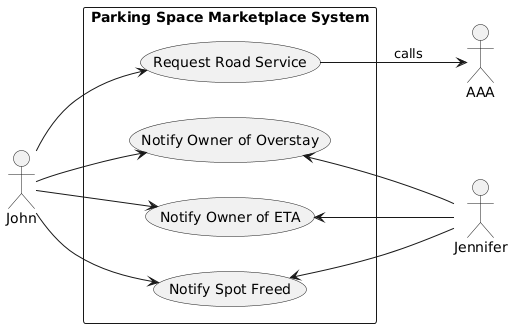

# SW Engineering CSC648-848-05 Summer 2025, T05: Parking Space Marketplace

# Milestone 1 V2

## Project/Application Title: Parking Space Marketplace

**Date:** June 23rd 2025

---

### History Table

| Milestone | Version | Date           |
|-----------|---------|----------------|
| M1        | V2      | June 23rd 2025 |
| M1        | V1      | June 17th 2025 |

---

### Table of Contents

1. [Executive Summary](#executive-summary)  
2. [Team](#team)  
3. [Main Use Cases](#main-use-cases)  
4. [Main Data Items and Entities](#main-data-items-and-entities)  
5. [Functional Requirements](#functional-requirements)  
6. [Non-Functional Requirements](#non-functional-requirements)  
7. [Competitive Analysis](#competitive-analysis)  
8. [Checklist](#checklist)  
9. [High-Level System Architecture and Technologies Used](#high-level-system-architecture-and-technologies-used)  
10. [List of Team Contributions](#list-of-team-contributions)  

---

## Team

| Student | Full Name             | SFSU Email             | GitHub Username      | Discord Username      | Role(s)                      |
|:-------:|:---------------------:|:----------------------:|:--------------------:|:---------------------:|:-----------------------------:|
|    #1   | Stella Parker         | <sparker11@sfsu.edu>     | @whoIsStella         | latchkeykid           | Team-lead / Backend-Lead/GitHub Master/Scrum Master |
|    #3   | Nathaniel Moreno      | <nmoreno@sfsu.edu>       | @NateM03             | ba_daniels            | Database Administrator        |
|    #4   | Fatma Almosawi        | <falmosawi@sfsu.edu>     | @fatma-al            | fatma.almosawi        | Scrum Master                  |
|    #5   | Krishna Shenoy        | <920875953@sfsu.edu>     | @krishs44            | krishnashenoy_71520   | Technical Writer              |
|    #6   | Juan Daniel Ramirez   | <jramirez9@sfsu.edu>     | @JuanDanielRamirez   | juanramirez_05991     | Frontend Lead                 |
|    #7   | Julianna Embalzado    | <eembalzado@mail.sfsu.edu> | julianna-embalzado | jejemon6201           | Software Architect            |

---

## Executive Summary

Parking in cities is a daily headache for millions, wasting time, fuel, and patience as drivers circle blocks searching for spots. Meanwhile, countless private parking spaces sit empty and unused. Parking Space Marketplace bridges this gap by creating a vibrant, community driven platform where anyone can list or discover parking spaces for short term use.

With Parking Space Marketplace, drivers can easily find available parking in their area, while property owners earn extra income by sharing their unused spots. Our platform offers reliable search, transparent pricing, and a user friendly experience that builds trust between drivers and space owners. By enabling better use of existing spaces, Parking Space Marketplace makes parking smarter, more affordable, and more convenient for everyone.

---

## Main Use Cases

### Use Case 1: List a Parking Space

Owner uploads info, sets price, and posts availability. If the info is incomplete, app prompts for missing data.

**Actors:** Macy (apartment resident), Parking Space Marketspace (System)

**Assumptions:**

- Macy has a phone and access to the internet.
- Macy has parking space she does not use often.
- Macy has a parking space that intrests renters.

**Use Case:**
Macy has been living in the city for a while now. As such, she has found her way to move around without the need for a car. Recently, Macy decided to get rid of some junk she had in her parking garage but is unsure of what to fill the space with. She does not want to leave it empty, as she believes that would be a waste of space. She surfs the web, looking for ideas or inspiration as to what to fill the garage with. During this search, Macy comes across the Parking Space Marketspace. Out of curiosity, she looks around the site and quickly finds out that she can sell her garage to people. She considers how many places of interest are near her home, specifically a park that is usually filled with lots of people, and so she decides to register her spot into the website. Not only has Macy figured out what to do with the garage, but she can earn some money on the side as well. The application makes it easy for her to list her parking space and change the price and when it is available for renters.

**Benefits:**

- Macy can set her price for the parking spot, allowing her to earn more money.
- Macy can decide when her garage is available, which allows her to plan ahead.
- Macy can if needed update her listing, making sure her parking space will be looked at for customers wanting to rent.

**Use Case Modeling:**

### Use Case 2: List a Parking Space

Renter enters location, desired time. System shows nearby available spots on a map. If no spaces found, System suggests adjusting filters or dates.

**Actors:** Bob (student), Josh (Bob’s friend), Parking Space Marketspace (System)

**Assumptions:**

- Bob has access to a phone and owns a car.
- Bob is aware of when and where he wants the desired parking place.
- Bob is able to pay for this service.

**Use Case:**
Bob has made his class schedule for next semester. He has classes every Tuesday and Thursday starting with Biology at 11:00 am. While Bob is excited to take Biology, he is also worried that there will not be any parking spaces left at that time. Bob asks his friend John for help. John suggests arriving at an earlier time to claim a parking spot, but Bob rejects the idea. He cannot arrive at the campus at an earlier time. Josh then suggests that Bob could take the class at another time to make sure he does not arrive late, but Bob explains that all other class times are full. Josh thinks for a moment before recommending Parking Space Marketplace. Bob decides to take a look at the website, despite never hearing about it. After making an account with his student email and filling in the location of his university, the site offers him a 50% student discount and shows him some nearby spaces available. He notices one that is pretty close to his Biology class and checks to see when he can claim the space. Luckily, he can reserve the spot up until his last class and for the entire semester. Bob can now look forward to taking Biology, especially with a guarantee that he will not be late due to parking.

**Benefits:**

- Bob can reserve a spot in advance and for how long, allowing him to plan ahead.
- Bob can choose a location to find nearby spots, giving him more freedom.
- Bob will save time as well as minimize the stress that comes with finding a parking space.
- Bob can find a parking space in his price range.

**Use Case Modeling:**

### Use Case 3

Renter selects a spot, reviews details, and confirms booking. If payment fails, System prompts renter to retry or choose a different method.

**Actors:** Richard (Customer/User), Parking Space MarketSpace (System)

**Assumptions:**

- Richard is a busy lawyer who frequently travels to the city for work.
- Richard already uses the Parking Space MarketSpace app.
- Richard relies on his default card payment for his payment method.

**Use Case:**
Richard is a busy lawyer who travels frequently to the city for work. He already uses the Parking Space Marketspace app to find parking spots in the city, as it is hard for him to find a parking spot that is next to his office building. To give Richard peace of mind when booking the parking space, he has already saved his card as a default card payment every time he books a parking space. Usually, it gives him a confirmation that the spot has been successfully booked. Unfortunately, Richard didn’t realize that the default card payment he has booked has already been expired. When Richard booked the usual parking spot that he usually goes for, the app gave him a notification that his card has already been expired so it cannot process the transaction. It prompted Richard to put a new card on file or to try it again. To make it easier for Richard, the app gave him an option to capture the image of his card, and it would fill up his information or he could write his information down manually. After choosing the first option, the app later on asked if he would like this new card to be his default card payment on file in which Richard opted in for. After fixing the payment issue, Richard proceeded to book his usual parking spot successfully giving him confirmation regarding the reservation as well as the information for the parking space to answer any questions the customer could have.

**Benefits:**

- Richard has security that his payment went through, and his booking was successful with a confirmation
- Efficiency and convenience with booking because of the saved card payment information.
- Richard has security and peace of mind regarding why the issue arises with his payment method.

**Use Case Modeling:**

### Use Case 4: Cancel a Booking

Renter or owner cancels before start time; system notifies the other party. If cancellation is too close to start, app enforces cancellation policy.

**Actors:** Leo (spot/owner), Derek (customer/renter), Parking Space Marketspace (System)

**Assumptions:**

- Either party can choose to cancel before the reservation start time
- The cancellation policies are in place and have been agreed upon.

**Use Case:**
Leo just realizes that he will not be able to use his driveway for the upcoming reservation as it will be inaccessible due to construction going on. He needs to cancel the reservation before the time that it starts, so he logs into the app and finds his active booking to cancel it. Derek the spot renter is immediately notified and receives a full refund since he was not the one to cancel and the cancellation happened 24 hours in advance. The app then provides Derek with suggested alternative parking spaces around the same area.

**Benefits:**

- Provides flexibility for both parties/users
- Handles refunds and re-bookings to make it simple and easy
- Nofications will be sent to both of the parties for communication.

**Use Case Modeling:**

### Use Case 5

Renter and owner communicate about arrival or specific instructions. If inappropriate messages are detected, admin is alerted.

**Actors:**  Koa (Renter), Milo (Owner), Parking Space MarketSpace (Company/admin)

**Assumptions:**

- Koa rented Milo’s parking space from 1:30 - 2:30 PM on the Parking Space MarketSpace (System)
- Milo has been using Parking Space MarketSpace to rent out his parking space and his parking space is in a popular area, as it is in the city and close to businesses that people usually go to
- Users have the option to message each other.
- The app has language moderation to make sure users have a postive expierence.

**Use Case:**
Koa is visiting the city to run some errands and found that Milo’s spot is close to the places that he needs to go to. Koa saw that the only time that his space is available is from 1:30 - 2:30 PM. Koa booked for that time slot but decided to come early to hopefully finish his errands earlier without telling Milo. Koa also received specific instructions to arrive on the time slot booked. Koa came at around 12:00 PM to the parking spot only to find out that it has been taken by another car. Koa contacted Milo saying he is here for the 1:30 - 2:30 parking spot appointment. Milo told Koa that the parking spot has already been booked by someone from 11:00 AM - 1:00 PM. Koa insisted that Milo can accommodate his situation since he came a long way from home to get into the city. Milo insisted that he cannot kick out guest who are already in the spot and who have booked it for that time slot. This made Koa mad since Milo could not accommodate to his requests and started cussing Milo out in the chat. Koa even made death threats towards Milo and said he is going to sue Milo for wasting his time. The admin got alerted to the inappropriate message that Koa was saying in the chat and gave a warning on Koa’s side that inappropriate messages are not allowed and could lead to his account being banned or suspended. On Milo’s side it gave him an option to block Koa and cancel his reservation. Milo not wanting to deal with Koa, he opted to block Koa and cancel his reservation. After Milo selected this option, Koa isn’t allowed to message Milo anymore as well as a notification saying his reservation has been canceled. There will be evidence about this interaction.

**Benefits:**

- Koa received specific instructions regarding the reservation, including the time slot of when his reservation starts. Koa has the privilege to message Milo regarding the reservation and vice versa, allowing issues to be addressed directly with the owner.
- Koa is given the chance to correct his behavior, letting him realize that his behavior is inappropriate towards Milo because of the warning given to him and the consequences given to him.
- Milo has the protection to not tolerate the inappropriate behavior that Koa has displayed by giving him an option to block and cancel Koa’s reservation.

**Use Case Modeling:**

### Use Case 6: Owner Reviews bookings and Earnings

Owner checks upcoming/past bookings and income dashboard. If dashboard fails to load, app displays support contact.

**Actors:** Olivia (Owner), Parking Space Marketplace (System), Customer Support

**Assumptions:**  

- Olivia has an active account with permission to view booking and payment data.  
- The system is operational, and Olivia has a reliable internet connection.  

**Use Case:**  
Olivia, the parking space owner, logs into the Parking Space Marketplace app and navigates to her dashboard, which displays a clear summary of all upcoming and past bookings for her parking spaces. The dashboard also provides detailed earnings reports over various timeframes, enabling Olivia to track income and analyze trends. She can filter bookings by date, status, or location, making it easy to manage multiple listings. If the dashboard fails to load, the app immediately shows contact information for customer support, so Olivia can quickly get assistance. Olivia uses this information to stay informed about her rental activity and make informed decisions regarding availability and pricing. Notifications about new bookings, cancellations, and completed rentals help keep Olivia up to date without constantly checking the app.

**Benefits:**  

- Provides Olivia with transparent and real-time information on bookings and earnings.  
- Offers prompt support access in case of technical issues, enhancing user confidence and satisfaction.

**Use Case Modeling:**

### Use Case 7: User Profile Management

User updates personal info, payment details, or preferences. If invalid info is entered, app requests corrections.

**Actors:** Kevin (User/Renter), Parking Space Marketspace (System)

**Assumptions:**  

- Kevin is logged into a verified account
- The system validates and stores updated data securely
- Kevin can make changes to personal information and payment details.

**Use Case:**  
Kevin just sold his house and is moving into a new home, and bought a new car as well. To make sure his account is still active and accurate, he logs into the app and goes to his profile settings. He then updates his home address, car license plate, and adds a new credit card as well for future payments. The system validates his card and securely updates his profile. Kevin then receives a confirmation email summarizing the changes, and now his account is ready to go again. This makes sure there will be no mix-ups with wrong information between the user and the renter.

**Benefits:**  

- Keeps user data accurate and secure  
- Allows easy booking and ensures users' info is accurate and trustworthy
- Kevin can stay connected to Parking Space Marketplace and make changes (changing address)

**Use Case Modeling:**

### Use case 8

Renter finds nearby parking for late night shifts. If no safe spot is available, app suggests alternative options.

**Actors:** Cynthia (Renter), Parking Space Marketspace System (System)

**Assumptions:**

- Cynthia owns or has access to a car
- Cynthia works night shifts
- Cynthia lives in a neighborhood with a concerning crime rate

**Use Case:**
Cynthia, who works night shifts, resides in a neighborhood with a high crime rate. Upon returning home from her shifts in the middle of the night, she consistently encounters difficulties in finding parking. The available parking spaces are often situated at considerable distances, necessitating lengthy walks back to her residence. This situation poses a significant safety concern for Cynthia, especially considering the prevalent news reports of violence against women in her area. To address this issue, Cynthia explored the possibility of securing a parking space closer to her home. She discovered that one of her neighbors had an unused parking spot that she could rent. This discovery brought her immense relief and satisfaction, as it eliminated the fear of unsafely returning home each night from work. Cynthia promptly rented the parking space using the application (Parking Place Marketplace) and experienced a profound sense of comfort upon returning home from work. This newfound convenience has significantly improved her overall well-being.

**Benefits:**

- Cynthia no longer needs to live in fear each night she comes home from work.
- Cynthia has a lower chance of any violence or crime committed to her.

**Use Case Modeling:**

#### Use case 9

Renter with mobility challenges secures a nearby accessible parking spot. If no accessible spot is found, Stystem suggests the closest available options.

**Actors:** Margaret (Renter), Parking Space Marketspace System (System)

**Assumptions:**

- Margaret has a car
- Margaret has health concerns (mobility impairment)
- There is limited street parking where she lives

**Use Case:**
Margaret, an elderly Renter with a mobility impairment, faces significant challenges in accessing her residence due to the limited street parking availability in her vicinity. The extended distances required to find parking near her home exacerbate her health condition, rendering walking an impractical option. Consequently, she has been confined to her home, avoiding the inconvenience and potential strain associated with long-distance walks. However, upon discovering the availability of a convenient parking spot on our website, Margaret has taken proactive steps to secure it. This arrangement has alleviated her concerns, enabling her to leave her home without the burden of excessive walking, particularly given her health limitations. By having a readily accessible parking space, Margaret can now freely engage in outdoor activities and enjoy life without the constraints of long-distance transportation.

**Benefits:**

- Margaret gets to leave the house more because she knows there will be parking for her.
- Accessibility
- Minimizes stress

**Use Case Modeling:**

### Use Case 10: Car trouble in currently rented parking space

Renter requests roadside assistance when experiencing car trouble. System charges for extended stay, notifies spot owner of delay, and updates both parties when the spot is available again.

**Actors:** John (Renter), Jennifer (Parking spot owner), Parking Space Marketplace, AAA (Tow service + road services)

**Assumptions:**

- John has a car and is occupying Jennifer's parking space
- John's car will not start because of cold weather
- Parking Space Marketplace has AAA (road service) help

**Use Case:**
John is currently renting Jennifer's parking spot using Parking Space Marketplace. He is in a business meeting, and when he gets back to his car he discovers that the cold weather killed his battery. The time before John has to give up his parking space for the next customer is 10 minutes away. John logs onto the application and chooses "road service" option. After charging John's credit card for the late stay in the parking spot, Parking Space Marketplace connects John to AAA (road service) so he can let them know of the dead battery and they can send someone to jump it, then the application lets Jennifer know that John will be occupying the parking spot longer than intended because of car trouble. It will also let Jennifer know the road service arrival time and will notify her when the parking spot is free after road service is done helping John with his vehicle.

**Benefits:**

- John can get road service (car trouble help) using Parking Space Marketplace
- Jennifer is kept in the loop about the overstay on her property

**Use Case Modeling:**

---

## Main Data Items and Entities

| Entity                | Meaning/Definition                                                                                                                                                                                                                                     | Usage                                                                                                  |
| --------------------- | ------------------------------------------------------------------------------------------------------------------------------------------------------------------------------------------------------------------------------------------------------ | ------------------------------------------------------------------------------------------------------ |
| **User**              | Any person with an account on the platform: owners (who list spaces), renters (who book spaces), or admins.                                                                                                                                            | Authentication, permissions, booking, profile management, messaging, payment, accessibility            |
| **Parking Space**      | A physical parking spot available for rent. Spaces can be standard or accessible (with features like ramps, extra space, or proximity to entrances). Each listing records accessibility status and features. | Searching, map display, availability management, filtering by accessibility, pricing, reviews          |
| **Booking**           | A reservation of a specific parking space for a defined period, linking a renter to a space (and its owner).                                                                                                                                            | Payment, calendar locking, booking history, notifications, enforcement of cancellation/refund policies |
| **Payment**           | The monetary transaction associated with a booking, covering reservation fees, refunds, or service charges.                                                                                                                                            | Payment tracking, refunds, owner earnings, renter receipts, financial reporting                        |
| **PaymentMethod**     | Saved credit/debit card or bank account information linked to a User account, can be set as default or updated.                                                                                                                                        | Secure payments, card management, validation, setting defaults, replacing expired methods              |
| **Message**           | In-app communications between users or with support/admins. May include booking instructions or behavioral warnings.                                                                                                                                   | Coordination (arrival, instructions), customer support, moderation, evidence in disputes               |
| **Review**            | Post booking feedback and ratings submitted by renters or owners, attached to users or parking spaces.                                                                                                                                                 | Building trust, community quality, search rankings, owner/renter reputation                            |
| **AdminAction**       | Intervention or actions by platform staff/admins: bans, warnings, dispute resolution, or moderation of content.                                                                                                                                        | Maintaining platform safety, resolving conflicts, logging critical actions, monitoring abuse           |
| **SupportTicket**     | Request from any user for technical or customer support (failed dashboard, refund issue, accessibility question).                                                                                                                                | Helpdesk workflow, issue escalation, communication history                                             |
| **ServiceRequest**    | A special booking event such as requesting roadside assistance (e.g., AAA), especially if car trouble affects booking.                                                                                                                                 | Emergency services, handling overstays, coordination with spot owner and service provider              |
| **EarningsDashboard** | Data view for owners showing cumulative and per booking income, trends, and active/past bookings.                                                                                                                                                      | Owner financial reporting, managing payouts, business decisions, troubleshooting                       |
| **Notification**      | Automated or manual alerts sent to users via app, email, or SMS (new booking, payment failed, cancellation, warning).                                                                                                                            | Keeping users informed, compliance, reminders, alerts on actions like cancellation or booking          |

---

## Functional Requirements

## 1. Renter

**1.1 Searching and Viewing Parking Spaces**

1.1.1 The renter shall be able to search for parking spaces by address.

1.1.2 The renter shall be able to search for parking spaces by date and time.

1.1.3 The renter shall be able to view parking spaces on an interactive map.

1.1.4 The renter shall be able to filter parking spaces by price, distance, amenities (eg., EV charging, covered), vehicle size compatibility, and accessibility status.

1.1.5 The renter shall be able to sort parking space search results by relevance, price, or distance.

1.1.6 The renter shall be able to view detailed information for each parking space, including photos, description, accessibility features, and owner-defined rules.

**1.2 Booking and Payment**

1.2.1 The renter shall be able to create a booking for a selected parking space.

1.2.2 The renter shall be able to select the desired date and time for the booking.

1.2.3 The renter shall be able to pay for a booking using multiple payment methods.

1.2.4 The renter shall be able to save, update, and remove payment methods from their account.

1.2.5 The renter shall be able to receive payment confirmations and notifications regarding the status of their booking.

1.2.6 The renter shall be able to cancel a booking, subject to the applicable refund policy.

**1.3 Managing Bookings and Reviews**

1.3.1 The renter shall be able to view a list of upcoming and past bookings.

1.3.2 The renter shall be able to extend an active booking, subject to availability.

1.3.3 The renter shall be able to leave a Review for a completed booking or parking space.

1.3.4 The renter shall be able to report issues with a parking space or booking.

**1.4 Profile and Communication**

1.4.1 The renter shall be able to update their profile information (contact details, vehicle info, accessibility needs).

1.4.2 The renter shall be able to manage notification preferences (receive booking reminders, payment alerts via app/email/SMS).

1.4.3 The renter shall be able to message the parking space owner about a booking.

1.4.4 The renter shall be able to access help resources and submit a SupportTicket for technical or customer support.

**1.5 Special Features**

1.5.1 The renter shall be able to request roadside assistance (ServiceRequest) if experiencing car trouble during an active booking.

1.5.2 The renter shall be able to receive navigation directions to the parking space location.

## 2. Owner

**2.1 Listing and Managing Parking Spaces**

2.1.1 The owner shall be able to create a new parking space listing by providing address, photos, description, amenities, accessibility features, and pricing.

2.1.2 The owner shall be able to set and edit availability windows for each parking space.

2.1.3 The owner shall be able to update details or remove an existing parking space listing.

2.1.4 The owner shall be able to temporarily unlist a parking space from the marketplace.

**2.2 Managing Bookings and Earnings**

2.2.1 The owner shall be able to view and manage all bookings for their parking spaces.

2.2.2 The owner shall be able to accept or decline incoming booking requests.

2.2.3 The owner shall be able to receive booking notifications and cancellation alerts.

2.2.4 The owner shall be able to access an EarningsDashboard displaying income by period and booking history.

2.2.5 The owner shall be able to update their banking/payment information to receive payouts.

**2.3 Communication and Reviews**

2.3.1 The owner shall be able to message renters about bookings.

2.3.2 The owner shall be able to review renters after completed bookings.

2.3.3 The owner shall be able to set specific rules for each parking space.

**2.4 Profile and Support**

2.4.1 The owner shall be able to update their profile and contact details.

2.4.2 The owner shall be able to submit support tickets for customer or technical support.

## 3. Admin

**3.1 User and Content Management**

3.1.1 The admin shall be able to view and manage all user accounts (renters, owners, admins).

3.1.2 The admin shall be able to suspend or ban user accounts as needed.

3.1.3 The admin shall be able to monitor and moderate user generated content, including listings, messages, Reviews, and booking records.

3.1.4 The admin shall be able to flag, remove, or edit inappropriate content or Reviews.

3.1.5 The admin shall be able to handle disputes between users and perform admin actions (warnings, penalties, etc.).

**3.2 Payments and Analytics**

3.2.1 The admin shall be able to view and manage all payments and transactions.

3.2.2 The admin shall be able to issue refunds and adjust commission or platform fees.

3.2.3 The admin shall be able to generate financial reports, analytics, and usage metrics.

3.2.4 The admin shall be able to monitor system health and performance.

**3.3 Platform Settings and Policies**

3.3.1 The admin shall be able to update platform terms, conditions, and privacy policy.

3.3.2 The admin shall be able to configure notification and penalty settings.

## 4. All Users

**4.1 Account Management and Access**

4.1.1 All users shall be able to register for an account.

4.1.2 All users shall be able to log in securely.

4.1.3 All users shall be able to reset a forgotten password.

4.1.4 All users shall be able to delete their account.

**4.2 General Features**

4.2.1 All users shall be able to access the help center or FAQ.

4.2.2 All users shall be able to view the privacy policy and terms of service.

4.2.3 All users shall be able to manage notification preferences

---

## Non-Functional Requirements

**1. Performance**

1.1 The system shall support at least 5,000 concurrent users without noticeable performance degradation.

1.2 Page load times for all main user flows (search, booking, dashboard) shall not exceed 3 seconds under typical North American network conditions (25 Mbps download, 3 Mbps upload, <100ms latency).

1.3 Search for parking space availability shall return results within 2 seconds for up to 10,000 listings.

1.4 All user actions (booking, payment, messaging) shall provide feedback or error notifications within 1 second.

**2. Reliability**  

2.1 All booking, cancellation, and payment transactions shall be atomic and consistent to prevent double booking, orphaned payments, or data loss.

2.2 The system shall maintain an uptime of at least 99.5% per calendar month, excluding scheduled maintenance.

2.3 Daily automated backups shall be performed for all critical data, backups shall be retained for a minimum of 30 days.

2.4 Disaster recovery procedures shall ensure system restoration within 6 hours of a major outage.

**3. Security**  

3.1 All sensitive user data including payment details, personally identifiable information, and messages shall be encrypted in transit using TLS 1.2+ and at rest using AES-256 or stronger.

3.2 The system shall implement Role Based Access Control (RBAC) to enforce separation of permissions between renters, owners, and admins.

3.3 All payment processing shall comply with PCI DSS requirements.

3.4 Passwords shall be hashed and salted using a secure, modern algorithm (argon2).

3.5 The system shall enforce multi-factor authentication (MFA) for all admin accounts.

**4. Privacy**

4.1 Users shall be able to view, edit, or delete their personal data and payment methods at any time via the platform interface.

4.2 User data, including message logs, booking history, and payment records, shall only be accessible to the account holder and authorized platform staff.

4.3 No user data shall be shared with third parties except as required for payment processing or legal compliance.

4.4 Data retention policies shall be transparent and compliant with GDPR, CCPA, and relevant privacy laws, deleted data shall be purged from backups within 30 days.

**5. Usability & Accessibility**

5.1 The user interface shall conform to WCAG 2.1 Level AA accessibility standards, ensuring support for screen readers, keyboard navigation, and sufficient color contrast.

5.2 The platform shall provide a responsive design for seamless use on desktop, tablet, and mobile devices, with user interface elements scaling appropriately.

5.3 All primary user flows (searching, booking, messaging, payment, support) shall be achievable with no more than five clicks from the homepage.

5.4 Contextual help, onboarding and tutorials shall be provided for first time users and complex features.

5.5 All accessible parking spaces must be clearly marked as such in listings, and filtering by accessibility must be supported.

**6. Look and Feel**

6.1 The application shall adhere to a consistent visual style, all UI components shall be built with Tailwind CSS and Headless UI, styled and structured according to an in house design guide inspired by Material Design principles.

6.2 The color palette, font, and layout shall remain consistent across all pages and devices.

6.3 Brand assets (logo, primary colors, fonts) shall be documented and used as specified in the project’s style guide.

**7. Maintainability**

7.1 The team shall use 4 spaces for indentation and UTF-8 encoding for all source files.

7.2 Pull requests must pass automated style and lint checks (PEP8 for Python, ESLint for JavaScript).

7.3 All changes must undergo peer review and approval by at least one other developer prior to merge.

7.4 Commit messages shall follow the Conventional Commits standard.

**8. Portability**

8.1 The admin web interface shall be deployable on Windows 10+, macOS 12+, and Ubuntu Linux 20.04+.

8.2 The renter and owner interfaces shall be compatible with the latest two major versions of iOS (Safari, Chrome) and Android (Chrome, Firefox) browsers.

8.3 The system shall be containerized (Docker) for ease of deployment across environments.

**9. Scalability**

9.1 The system architecture shall support horizontal scaling at the application, web server, and database layers.

9.2 Data storage and search solutions (database indexing, caching) shall maintain user facing performance as the dataset grows by 10x.

9.3 The messaging, notification, and support ticket subsystems shall be able to handle bursts of up to 2,000 events/minute.

**11. Compatibility**

11.1 The platform shall support at least the two most recent major releases of Chrome, Firefox, Safari, and Edge browsers.

11.2 The system shall integrate with at least two major third party payment gateways (e.g., Stripe, PayPal) and Google Maps API, with clear versioning and upgrade paths.

11.3 Browser and OS support details shall be published in the system documentation for end users and admins.

**12. Compliance**

12.1 The platform shall comply with GDPR, CCPA, and any other applicable local or federal data protection laws.

12.2 Accessibility, anti discrimination, and consumer protection legislation shall be followed in all markets where the platform is available.

12.3 All required user agreements, privacy policies, and terms of service shall be visible and accessible on the platform.

**13. Supportability**

13.1 The system shall provide real-time alerts for major system failures, booking/payment errors, and performance degradation to the admin dashboard and support teams.

13.2 Support teams shall have secure access to diagnostic logs, anonymized user activity reports, and system health metrics.

13.3 Support shall be available via email messaging during posted business hours (9am-6pm PT, M-F).

13.4 An incident management plan, including escalation procedures and regular review, shall be maintained and tested quarterly.

13.5 The system shall be supported by Safari browser version 11.1.1 and later, Chrome 90+, Firefox 90+, Edge 90+, iOS 15+, and Android 11+.

---

## Competivie Analysis

### Important Features Table

| Features/Companies | Spacer | SpotHero | Park Mobile | AirGarage | YourParkingSpace |
| --- | --- | --- | --- | --- | --- |
| Strengths | The top cities of the US are covered | Real time inventory | Public-private event partnerships | Automates entire operations | Offers long-term options |
| Weaknesses | Only buy a space monthly | Only available in North America | Less flexibility when it comes from peer to peer | Audience is focused on Institutional owners | UK-centric |
| Pricing | Variable | Event based pricing | Small convenience fees for mobile use | No upfront cost for owners | Subscription plans for regular users |
| Social Media | Instagram, Twitter, and Facebook | Instagram, twitter, linkedIn. Event based contents | Instagram, Twitter, LinkedIn | None except for LinkedIn and Instagram | UK-specific campaign |
| Onboarding Experience | Easy to understand instructions | Fast email and social media login | Utility focused  | Targets lot owners specifically | Sign-up is complicated and onboarding tailored to specific location |
| Links  | [https://www.spacer.com](https://www.spacer.com/) | [https://spothero.com](https://spothero.com/) | <https://parkmobile.io/> | <https://www.airgarage.com/> | <https://www.yourparkingspace.co.uk/> |

### High-level Comparison  

| Features/Companies | Parking Space Marketspace | Spacer | SpotHero | Park Mobile | AirGarage | YourParkingSpace |
| --- | --- | --- | --- | --- | --- | --- |
| Real-time booking | ++ | +  | + | + | + | + |
| Peer-to-peer listings  | ++ | + | - | - | - | + |
| EV charging support | ++ | +  | + | + | + | + |
| Recurring/long-term booking | ++ | + | - | - | + | + |
| Vehicle License Insurance | ++ | + | - | - | - | - |
| Distcounts for active college students | ++ | - | - | - | - | - |

| Symbol | Meaning            |
| ------ | ------------------ |
| -      | Not implemented    |
| +      | Implemented        |
| ++     | Plan to improve it |

While our idea is not new to the market, our service will have multiple advantages over the competition. Aside from providing the features
mentioned in the high level comparison, our major competitive edge is giving the user complete freedom and fair pricing. The four companies mentioned above
all enact limitations on how their users can park. Park Mobile allows their users to chose how long they wish to park, however, they can
only park for at most a day as well as adding transaction fees to its varying rates. YourParkingSpace gives their users more freedom than Park Mobile, but it still limits them for at most three
days parking and has a 20% uplift and a 3% processing fee on top of owner-set prices. Then there are SpotHero and Spacer, which only cater to monthly parking, with prices ranging from $20-$35 daily in San Francisco via SpotHero or $200-$400+ monthly with Spacer. As for AirGarage,
their service depends on their partners, which are usually parking lots or parking garages who are limited to daily parking and have an hourly rate of 20$.
While these services are nice, they fail to solve all problems involving parking. What if there is a student who has class from 12:00 to 3:00
every Tuesday and Thursday for five months? There is no easy way for them to guarantee a parking spot for an entire semester. That is, without our service.
In other words, our service will handle the more specific scenarios that remain unresolved, or require a difficult solution, by giving more
flexibility to the user. No daily limit, no monthly limit, no more unreasonable prices, just complete freedom to register at specific times for some duration, on top of
what the comptetion already provides.

## Checklist

- [x] Found a time slot outside of class? DONE
- [x] GitHub master branch chosen? DONE  
- [x] Team selected frameworks & deployment server? DONE  
- [x] Everyone read M1 spec? DONE
- [x] GitHub repo organized per class guidelines? DONE  

---

## High-Level System Architecture and Technologies Used

- **Server:** AWS EC2  
- **Operating Systems:** Windows 11, Linux Mint, macOS  
- **Database:** PostgreSQL  
- **Web Server:** AWS ALB
- **Backend Language:** Python  
- **Backend Framework:** Django  
- **Frontend Language:** JavaScript (React), CSS, HTML  
- **Frontend Framework:** Next.js  
- **Additional Tech:** WSL, Poetry, npm/Yarn
- **IDE:** Visual Studio Code, DBeaver  
- **SSL Certificate:** AWS ELB (automatic HTTPS via Let’s Encrypt)  
- **Containerization:** Docker (running on EC2)
- **Object storge:**  S3
- **Rate Limiting:** Django ORM
- **Backend WSGI Server:** Gunicorn (running within Docker containers)

---

| Team Member | Contributions                                                                                                                             |
|-------------|--------------------------------------------------------------------------------------------------------------------------------------------|
| Nathan   8   | - Wrote Use Cases 4 & 7 - Created UML diagram for Use Case 7 - Set up basic PostgreSQL database - Updated personal info          |
| El Juliana 8 | - Wrote Use Cases 3 & 5 - Conducted competitive analysis for SpotHero, ParkMobile, AirGarage, YourParkingSpace - Created high-level comparison table with features (real-time booking, peer-to-peer, EV charging, recurring long-term, vehicle/license insurance) - Added bio & picture                          |
| Krishna  8   | - Added bio & picture (pushed to dev branch) - Improved styling across pages - Wrote Use Case 10 - Expanded sentences in other use cases - Enhanced frontend aesthetics and visual design |
| Juan    7   | - Wrote Use Cases 1 & 2 - Filled “Spacer” column in important features & high-level comparison tables - Drafted paragraph on product’s competitive edge |
| Stella  10    | - Served as Team Lead - Created backend AWS infrastructure -  Set up `credentials` folder with SSH & DB config - Implemented core frontend functionality  - Implemented core backend functionality  - Added Use Case 6  - Created 9/10 Use case diagrams  - wrote functional & non-functional requirements
| Fatma  4   | - Contributed to Milestone 1 deliverables - Added informational content to the About page  - Added Use Case 9 & 10                                                |

---
