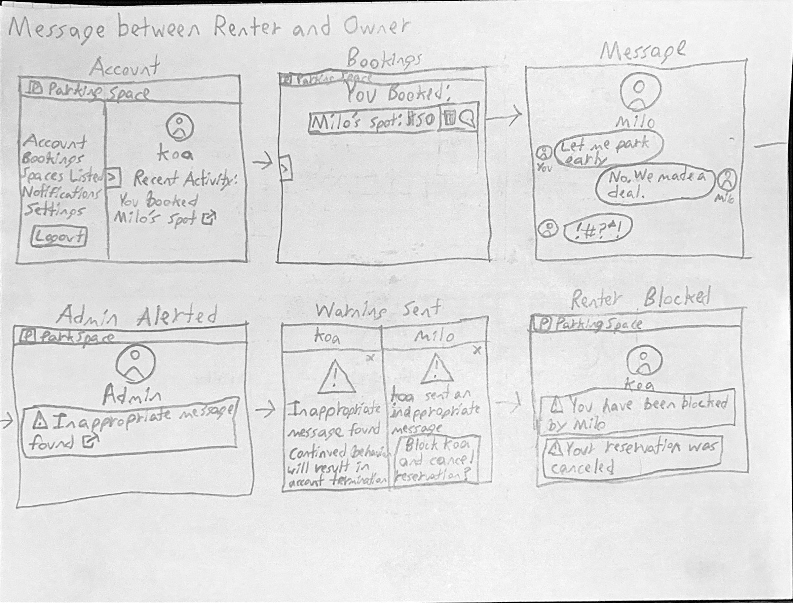
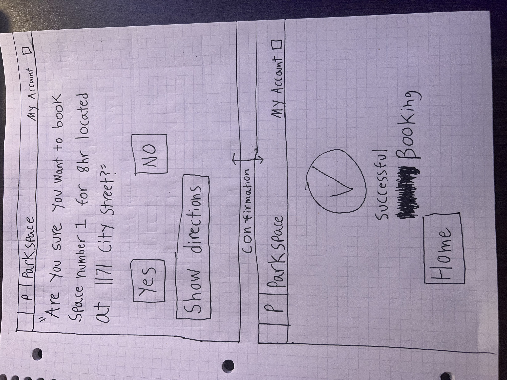
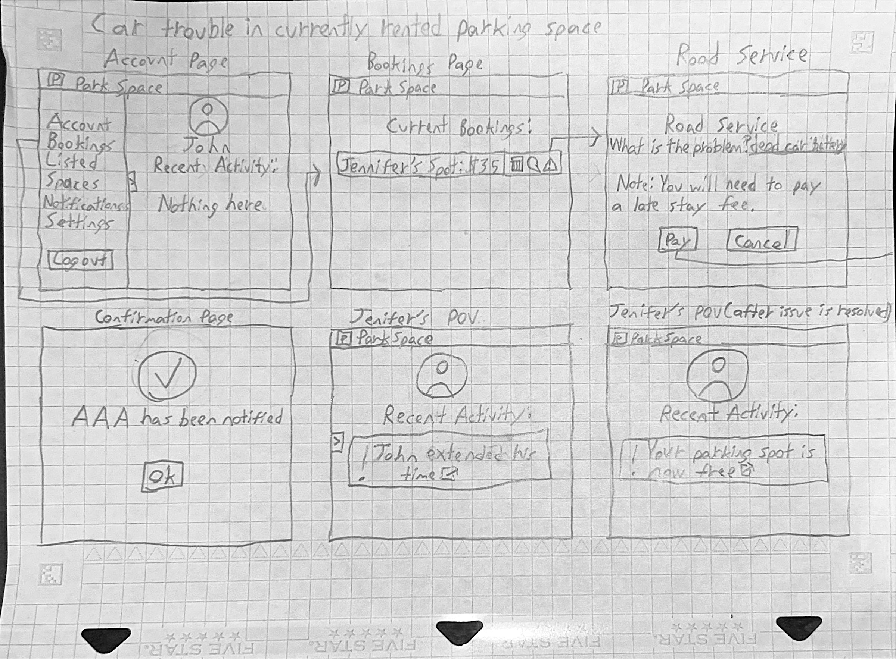
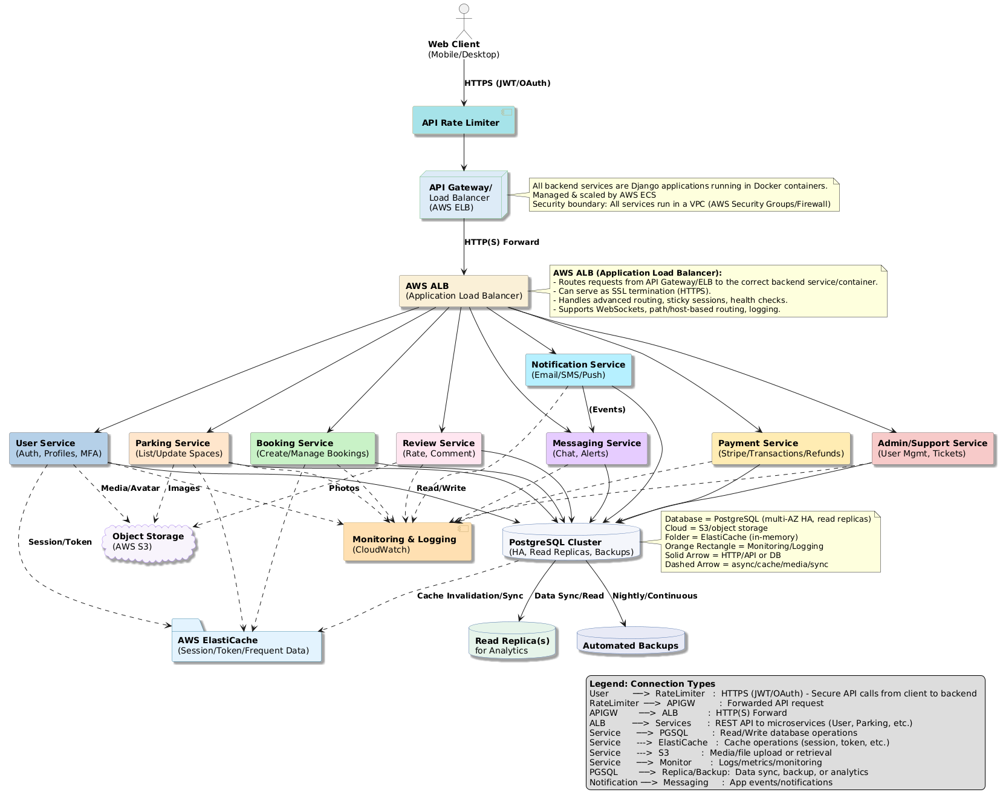
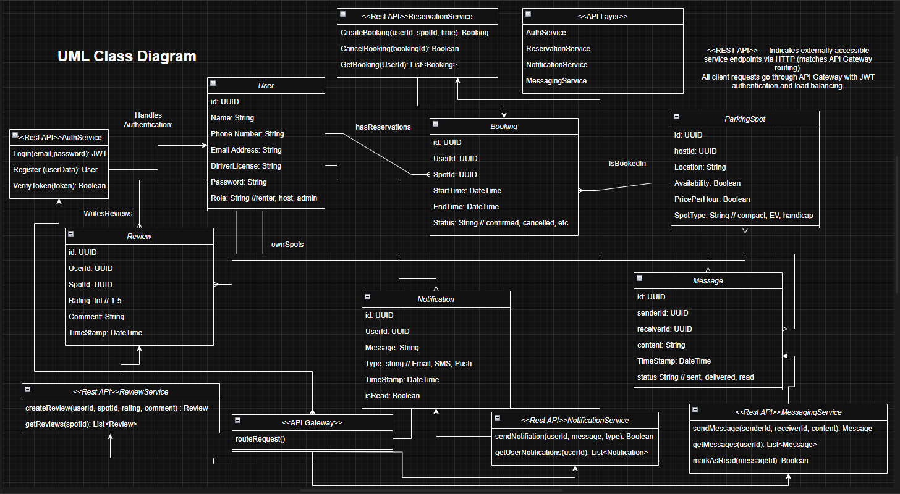
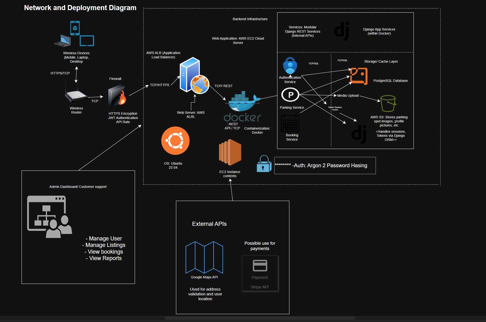
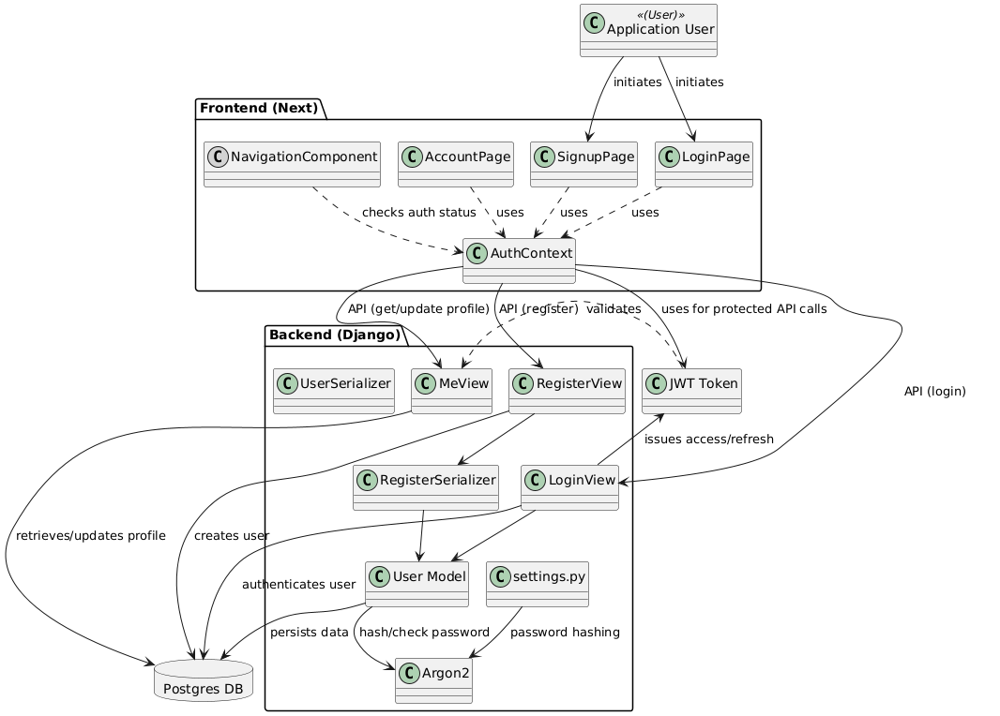

# SW Engineering CSC648-848-05 Summer 2025, T05: Parking Space Marketplace

# Milestone 2 V1

## Project/Application Title: Parking Space Marketplace

**Date:** July 3rd 2025

---

### History Table

| Milestone | Version | Date           |
|-----------|---------|----------------|
| M2        | V1      | July 3rd 2025  |
| M1        | V2      | June 23rd 2025 |
| M1        | V1      | June 17th 2025 |

---

## Team

| Student | Full Name             | SFSU Email             | GitHub Username      | Discord Username      | Role(s)                      |
|:-------:|:---------------------:|:----------------------:|:--------------------:|:---------------------:|:-----------------------------:|
|    #1   | Stella Parker         | <sparker11@sfsu.edu>     | @whoIsStella         | latchkeykid           | Team-lead / Backend-Lead/GitHub Master/Scrum Master |
|    #3   | Nathaniel Moreno      | <nmoreno@sfsu.edu>       | @NateM03             | ba_daniels            | Database Administrator        |
|    #4   | Fatma Almosawi        | <falmosawi@sfsu.edu>     | @fatma-al            | fatma.almosawi        | Scrum Master                  |
|    #5   | Krishna Shenoy        | <920875953@sfsu.edu>     | @krishs44            | krishnashenoy_71520   | Technical Writer              |
|    #6   | Juan Daniel Ramirez   | <jramirez9@sfsu.edu>     | @JuanDanielRamirez   | juanramirez_05991     | Frontend Lead                 |
|    #7   | Julianna Embalzado    | <eembalzado@mail.sfsu.edu> | julianna-embalzado | jejemon6201           | Software Architect            |

---

### Table of Contents

1. [Data Definitions](#data-definitions)
2. [Prioritized High-Level Functional Requirements](#prioritized-high-level-functional-requirements)
3. [Mockups/Storyboards](#Mockups/Storyboards)  
4. [High-Level System Design](#high-level-system-design)  
5. [Key Project Risks](#key-project-risks)  
6. [Project Management](#project-management)  
7. [List of Team Contributions](#list-of-team-contributions)  

---

## Data Definitions

### User

| Attribute            | Type         | Constraints / Notes                                        |
| -------------------- | ------------ | ---------------------------------------------------------- |
| user\_id             | UUID/serial  | PK, unique, not null                                       |
| email                | VARCHAR(255) | unique, not null, must be valid email                      |
| password\_hash       | VARCHAR(255) | not null (argon2, salted)                                  |
| first\_name          | VARCHAR(100) | not null                                                   |
| last\_name           | VARCHAR(100) | not null                                                   |
| phone\_number        | VARCHAR(20)  | nullable, validated                                        |
| role                 | ENUM         | 'renter', 'owner', 'admin'; not null                       |
| mfa\_enabled         | BOOLEAN      | default: false                                             |
| is\_active           | BOOLEAN      | default: true                                              |
| created\_at          | TIMESTAMP    | auto-set                                                   |
| profile\_image\_url  | VARCHAR(300) | nullable; image (<5MB, jpg/png/webp, 512x512 max)          |
| address              | VARCHAR(255) | nullable; for owner payout/tax, user personalization       |
| vehicle\_license     | VARCHAR(20)  | nullable; for renters, validated, format: country-specific |
| accessibility\_needs | TEXT         | nullable; e.g., wheelchair access required                 |
| notification\_prefs  | JSON         |  email: true, sms: false, push: true           |

### Parking Space

| Attribute              | Type         | Constraints / Notes                                          |
| ---------------------- | ------------ | ------------------------------------------------------------ |
| space\_id              | UUID/serial  | PK, unique, not null                                         |
| owner\_id              | UUID         | FK to User, not null                                         |
| address                | VARCHAR(255) | not null, geocoded for map                                   |
| latitude               | FLOAT        | not null                                                     |
| longitude              | FLOAT        | not null                                                     |
| description            | TEXT         | not null, 1-1000 chars                                       |
| price\_per\_hour       | DECIMAL(6,2) | not null, >=0, USD                                           |
| price\_per\_day        | DECIMAL(6,2) | optional, >=0, USD                                           |
| is\_accessible         | BOOLEAN      | default: false (accessible features for ADA)                 |
| features               | JSON         | e.g., ev_charging: true, covered: true, size: "XL"     |
| images                 | JSON         | array of image URLs (<10, each <5MB, jpg/png/webp, 1024x768) |
| status                 | ENUM         | 'active', 'unlisted', 'pending', 'banned'                    |
| rules                  | TEXT         | nullable; e.g., “No overnight parking, call if late”         |
| created\_at            | TIMESTAMP    | auto-set                                                     |
| updated\_at            | TIMESTAMP    | auto-set                                                     |
| availability\_schedule | JSON         | e.g., mon:[8-18], tue:[8-18], ...     |

### Booking

| Attribute            | Type         | Constraints / Notes                                        |
| -------------------- | ------------ | ---------------------------------------------------------- |
| booking\_id          | UUID/serial  | PK, unique, not null                                       |
| space\_id            | UUID         | FK to ParkingSpace, not null                               |
| renter\_id           | UUID         | FK to User, not null                                       |
| owner\_id            | UUID         | FK to User, not null                                       |
| start\_time          | TIMESTAMP    | not null, UTC                                              |
| end\_time            | TIMESTAMP    | not null, UTC                                              |
| status               | ENUM         | 'pending', 'confirmed', 'canceled', 'completed', 'no-show' |
| amount\_total        | DECIMAL(6,2) | not null, >=0, USD                                         |
| payment\_id          | UUID         | FK to Payment, nullable (pending booking)                  |
| cancellation\_reason | VARCHAR(255) | nullable                                                   |
| created\_at          | TIMESTAMP    | auto-set                                                   |
| last\_updated        | TIMESTAMP    | auto-set                                                   |
| review\_left         | BOOLEAN      | default: false                                             |

### Payment

| Attribute           | Type         | Constraints / Notes                                      |
| ------------------- | ------------ | -------------------------------------------------------- |
| payment\_id         | UUID/serial  | PK, unique, not null                                     |
| booking\_id         | UUID         | FK to Booking, not null                                  |
| user\_id            | UUID         | FK to User, payer (usually renter), not null             |
| amount              | DECIMAL(6,2) | not null, >=0, USD                                       |
| status              | ENUM         | 'pending', 'succeeded', 'failed', 'refunded', 'disputed' |
| payment\_method\_id | UUID         | FK to PaymentMethod, not null                            |
| created\_at         | TIMESTAMP    | auto-set                                                 |
| refunded\_at        | TIMESTAMP    | nullable                                                 |
| transaction\_ref    | VARCHAR(100) | Stripe/PayPal reference, unique                          |

### Payment Method

| Attribute           | Type         | Constraints / Notes                             |
| ------------------- | ------------ | ----------------------------------------------- |
| payment\_method\_id | UUID/serial  | PK, unique, not null                            |
| user\_id            | UUID         | FK to User, not null                            |
| card\_brand         | VARCHAR(20)  | 'Visa', 'MasterCard', 'Amex'; or 'PayPal' |
| last4               | VARCHAR(4)   | not null                                        |
| expiry\_month       | INT          | 1-12                                            |
| expiry\_year        | INT          | four-digit year                                 |
| is\_default         | BOOLEAN      | default: false                                  |
| token               | VARCHAR(255) | Encrypted; never store raw PAN                  |
| created\_at         | TIMESTAMP    | auto-set                                        |

### Message

| Attribute       | Type         | Constraints / Notes                          |
| --------------- | ------------ | -------------------------------------------- |
| message\_id     | UUID/serial  | PK, unique, not null                         |
| sender\_id      | UUID         | FK to User, not null                         |
| recipient\_id   | UUID         | FK to User, not null                         |
| booking\_id     | UUID         | FK to Booking, nullable (general or support) |
| content         | TEXT         | not null, 1-2000 chars, profanity check      |
| sent\_at        | TIMESTAMP    | auto-set                                     |
| is\_flagged     | BOOLEAN      | default: false                               |
| flagged\_reason | VARCHAR(100) | nullable, e.g., 'abusive', 'spam'            |

### Review

| Attribute    | Type        | Constraints / Notes            |
| ------------ | ----------- | ------------------------------ |
| review\_id   | UUID/serial | PK, unique, not null           |
| author\_id   | UUID        | FK to User, not null           |
| booking\_id  | UUID        | FK to Booking, not null        |
| target\_type | ENUM        | 'user', 'space'                |
| target\_id   | UUID        | FK to User or ParkingSpace     |
| rating       | INT         | 1-5 stars, not null            |
| comment      | TEXT        | nullable, 1-1000 chars         |
| created\_at  | TIMESTAMP   | auto-set                       |
| is\_visible  | BOOLEAN     | default: true (admin can hide) |

### AdminAction

| Attribute    | Type        | Constraints / Notes                                |
| ------------ | ----------- | -------------------------------------------------- |
| action\_id   | UUID/serial | PK, unique, not null                               |
| admin\_id    | UUID        | FK to User (admin), not null                       |
| user\_id     | UUID        | FK to User, nullable (target)                      |
| action\_type | ENUM        | 'ban', 'warn', 'refund', 'edit', 'resolve\_ticket' |
| reason       | TEXT        | not null, 1-500 chars                              |
| created\_at  | TIMESTAMP   | auto-set                                           |

### ServiceRequest

| Attribute     | Type        | Constraints / Notes                               |
| ------------- | ----------- | ------------------------------------------------- |
| request\_id   | UUID/serial | PK, unique, not null                              |
| booking\_id   | UUID        | FK to Booking, not null                           |
| user\_id      | UUID        | FK to User, not null                              |
| service\_type | ENUM        | 'roadside', 'unlock', 'other'                     |
| status        | ENUM        | 'pending', 'in\_progress', 'resolved', 'canceled' |
| created\_at   | TIMESTAMP   | auto-set                                          |
| resolved\_at  | TIMESTAMP   | nullable                                          |
| notes         | TEXT        | nullable                                          |

### EarningsDashboard _this can be matiealized or agrigated_

| Attribute       | Type          | Constraints / Notes                       |
| --------------- | ------------- | ----------------------------------------- |
| owner\_id       | UUID          | FK to User, not null                      |
| period          | ENUM          | 'daily', 'weekly', 'monthly', 'all\_time' |
| total\_earnings | DECIMAL(10,2) | not null, USD                             |
| num\_bookings   | INT           | not null                                  |
| last\_updated   | TIMESTAMP     | auto-set                                  |

### Notification

| Attribute        | Type        | Constraints / Notes                                |
| ---------------- | ----------- | -------------------------------------------------- |
| notification\_id | UUID/serial | PK, unique, not null                               |
| user\_id         | UUID        | FK to User, not null                               |
| type             | ENUM        | 'booking', 'payment', 'cancel', 'support', 'alert' |
| content          | TEXT        | not null, 1-500 chars                              |
| is\_read         | BOOLEAN     | default: false                                     |
| sent\_at         | TIMESTAMP   | auto-set                                           |

---

### Priority 1

#### 1. Renter

**Section 1.1: Searching and Viewing Parking Spaces**

- 1.1.1 The renter shall be able to search for parking spaces by address.
- 1.1.2 The renter shall be able to search for parking spaces by date and time.
- 1.1.3 The renter shall be able to view parking spaces on an interactive map.

**Section 1.2: Booking and Payment**

- 1.2.1 The renter shall be able to create a booking for a selected parking space.
- 1.2.2 The renter shall be able to select the desired date and time for the booking.
- 1.2.3 The renter shall be able to pay for a booking using multiple payment methods.
- 1.2.4 The renter shall be able to save, update, and remove payment methods from their account.
- 1.2.5 The renter shall be able to receive payment confirmations and notifications regarding the status of their booking.
- 1.2.6 The renter shall be able to cancel a booking, subject to the applicable refund policy.

**Section 1.4: Profile and Communication**

- 1.4.3 The renter shall be able to message the parking space owner about a booking.

#### 2. Owner

**Section 2.1: Listing and Managing Parking Spaces**

- 2.1.1 The owner shall be able to create a new parking space listing by providing address, photos, description, amenities, accessibility features, and pricing.
- 2.1.2 The owner shall be able to set and edit availability windows for each parking space.
- 2.1.3 The owner shall be able to update details or remove an existing parking space listing.

**Section 2.2: Managing Bookings and Earnings**

- 2.2.1 The owner shall be able to view and manage all bookings for their parking spaces.
- 2.2.2 The owner shall be able to accept or decline incoming booking requests.
- 2.2.5 The owner shall be able to update their banking/payment information to receive payouts.

**Section 2.3: Communication and Reviews**

- 2.3.3 The owner shall be able to set specific rules for each parking space.

**Section 2.4: Profile and Support**

- 2.4.1 The owner shall be able to update their profile and contact details.

#### 3. Admin

**Section 3.1: User and Content Management**

- 3.1.1 The admin shall be able to view and manage all user accounts (renters, owners, admins).
- 3.1.2 The admin shall be able to suspend or ban user accounts as needed.
- 3.1.3 The admin shall be able to monitor and moderate user-generated content, including listings, messages, reviews, and booking records.
- 3.1.4 The admin shall be able to flag, remove, or edit inappropriate content or reviews.
- 3.1.5 The admin shall be able to handle disputes between users and perform admin actions (warnings, penalties, etc.).

**Section 3.2: Payments and Analytics**

- 3.2.1 The admin shall be able to view and manage all payments and transactions.
- 3.2.2 The admin shall be able to issue refunds and adjust commission or platform fees.
- 3.2.3 The admin shall be able to generate financial reports, analytics, and usage metrics.
- 3.2.4 The admin shall be able to monitor system health and performance.

#### 4. All Users

**Section 4.1: Account Management and Access**

- 4.1.1 All users shall be able to register for an account.
- 4.1.2 All users shall be able to log in securely.
- 4.1.3 All users shall be able to reset a forgotten password.
- 4.1.4 All users shall be able to delete their account.

**Section 4.2: General Features**

- 4.2.2 All users shall be able to view the privacy policy and terms of service.
- 4.2.3 All users shall be able to manage notification preferences.

---

### Priority 2

#### 1. Renter

**Section 1.1: Searching and Viewing Parking Spaces**

- 1.1.5 The renter shall be able to sort parking space search results by relevance, price, or distance.
- 1.1.6 The renter shall be able to view detailed information for each parking space, including photos, description, accessibility features, and owner-defined rules.

**Section 1.3: Managing Bookings and Reviews**

- 1.3.1 The renter shall be able to view a list of upcoming and past bookings.
- 1.3.2 The renter shall be able to extend an active booking, subject to availability.
- 1.3.3 The renter shall be able to leave a review for a completed booking or parking space.
- 1.3.4 The renter shall be able to report issues with a parking space or booking.

**Section 1.4: Profile and Communication**

- 1.4.1 The renter shall be able to update their profile information (contact details, vehicle info, accessibility needs).
- 1.4.2 The renter shall be able to manage notification preferences (receive booking reminders, payment alerts via app/email/SMS).

#### 2. Owner

**Section 2.1: Listing and Managing Parking Spaces**

- 2.1.4 The owner shall be able to temporarily unlist a parking space from the marketplace.

**Section 2.2: Managing Bookings and Earnings**

- 2.2.3 The owner shall be able to receive booking notifications and cancellation alerts.
- 2.2.4 The owner shall be able to access an Earnings Dashboard displaying income by period and booking history.

#### 3. Admin

**Section 3.3: Platform Settings and Policies**

- 3.3.1 The admin shall be able to update platform terms, conditions, and privacy policy.
- 3.3.2 The admin shall be able to configure notification and penalty settings.

#### 4. All Users

**Section 4.2: General Features**

- 4.2.1 All users shall be able to access the help center or FAQ.

---

### Priority 3

#### 1. Renter

**Section 1.1: Searching and Viewing Parking Spaces**

- 1.1.4 The renter shall be able to filter parking spaces by price, distance, amenities (e.g., EV charging, covered), vehicle size compatibility, and accessibility status.

**Section 1.4: Profile and Communication**

- 1.4.4 The renter shall be able to access help resources and submit a support ticket for technical or customer support.

**Section 1.5: Special Features**

- 1.5.1 The renter shall be able to request roadside assistance (ServiceRequest) if experiencing car trouble during an active booking.
- 1.5.2 The renter shall be able to receive navigation directions to the parking space location.

#### 2. Owner

**Section 2.3: Communication and Reviews**

- 2.3.1 The owner shall be able to message renters about bookings.
- 2.3.2 The owner shall be able to review renters after completed bookings.

**Section 2.4: Profile and Support**

- 2.4.2 The owner shall be able to submit support tickets for customer or technical support.

---

## Mockups/Storyboards

### Use Case 1: List a Parking Space

Owner uploads info, sets price, and posts availability. If the info is incomplete, app prompts for missing data.

---

### Use Case 2: List a Parking Space

Renter enters location, desired time. System shows nearby available spots on a map. If no spaces found, System suggests adjusting filters or dates.

---

### Use Case 3

Renter selects a spot, reviews details, and confirms booking. If payment fails, System prompts renter to retry or choose a different method.

---

### Use Case 4: Cancel a Booking

Renter or owner cancels before start time; system notifies the other party. If cancellation is too close to start, app enforces cancellation policy.

---

### Use Case 5

Renter and owner communicate about arrival or specific instructions. If inappropriate messages are detected, admin is alerted.

---

### Use Case 6: Owner Reviews bookings and Earnings

Owner checks upcoming/past bookings and income dashboard. If dashboard fails to load, app displays support contact.

---

### Use Case 7: User Profile Management

User updates personal info, payment details, or preferences. If invalid info is entered, app requests corrections.

---

### Use case 8

Renter finds nearby parking for late night shifts. If no safe spot is available, app suggests alternative options.

---

### Use case 9

Renter with mobility challenges secures a nearby accessible parking spot. If no accessible spot is found, Stystem suggests the closest available options.

---

### Use Case 10: Car trouble in currently rented parking space

Renter requests roadside assistance when experiencing car trouble. System charges for extended stay, notifies spot owner of delay, and updates both parties when the spot is available again.

---

## High-Level System Design

### DBMS Selection

The SQL framework we decided upon is PostgreSQL, primarily because of its support of geographic data and spatial indexing. This is
especially important as our website revolves around both the renter and the owner having access to a map to find or place their
parking spots. Moreover, PostgreSQL allows for scalability, which will be useful as our website has no upper limit of users or data.
One final feature to note is PostgreSQL's security, which is critical for us since we will be dealing with personal information of
many users, such as credit card information.

### Database Organization

---

### **Core Entities**

#### 1. **User**

- **Role:** Central to the system. Represents a person using the platform (can be an Owner, Renter, or Admin).

- **Attributes:** Includes identifying info (email, name), authentication (password hash), and role.

- **Relationships:**

  - _Owns or Rents_ a parking space.

  - _Creates_ Bookings, Reviews, Payments, Messages, and Support Tickets.

#### 2. **ParkingSpace**

- **Role:** Represents a rentable parking spot or space.

- **Attributes:** Location (lat/lon, address), price, availability, owner reference, amenities.

- **Relationships:**

  - _Belongs to_ an Owner (User).

  - _Has many_ Bookings, Reviews, Messages, etc.

#### 3. **Booking**

- **Role:** Tracks each time a Renter books a ParkingSpace.

- **Attributes:** Dates/times, status, amount, references to User (renter) and ParkingSpace.

- **Relationships:**

  - _Belongs to_ a User (Renter).

  - _Belongs to_ a ParkingSpace.

#### 4. **Payment/PaymentMethod**

- **Role:** Payment records and payment method management for users.

- **Attributes:** Amount, method, status, reference to Booking, User.

- **Relationships:**

  - _Belongs to_ a User.

  - _Linked to_ a Booking.

#### 5. **Review**

- **Role:** Ratings/comments left by Renters for Owners or ParkingSpaces.

- **Attributes:** Rating value, comment, references to User and ParkingSpace.

- **Relationships:**

  - _Belongs to_ a User (who leaves it).

  - _Belongs to_ a ParkingSpace.

#### 6. **Message**

- **Role:** Communication (chat, notifications) between Users, possibly about a specific Booking or ParkingSpace.

- **Attributes:** Text, timestamps, sender/recipient.

- **Relationships:**

  - _Linked to_ User(s), ParkingSpace, Booking, etc.

#### 7. **SupportTicket/Notification/AdminAction**

- **Role:** For platform support, notifications, and admin actions (moderation, tickets).

- **Attributes:** Ticket status, admin actions, notification details.

- **Relationships:**

  - _Linked to_ Users, Bookings, or other entities as needed.

---

### **Other Notable Elements**

- **Geospatial data**: ParkingSpace table includes latitude/longitude, supporting “find nearby” queries.

- **Role-Based Access**: User roles (admin/owner/renter) can be enforced by attributes and relationships.

- **Extensibility**: The ERD supports features like favorites, coupons, multi-factor auth, via additional tables/fields.

---

### **Relationship Summary**

- **One-to-many:**

  - One User can own many ParkingSpaces.

  - One ParkingSpace can have many Bookings and Reviews.

  - One User can create many Bookings and Reviews.

- **Many-to-many:**

  - Handled via join tables for features like favorites, notifications, etc.

---

### **What’s Happening: High-Level Flow**

1. **User (Renter) registers**, adds payment info.

2. **Owner lists a ParkingSpace**, sets price/location.

3. **Renter searches for nearby ParkingSpaces** (geolocation).

4. **Booking is created** by the Renter for a ParkingSpace.

5. **Payment is processed** and recorded.

6. **Messaging allows communication** between Renter and Owner.

7. **After booking**, Renter can leave a Review.

8. **Support, Admin, and Notification systems** keep the platform running smoothly.

---

### **Summary Table**

|Entity|Description|Key Relationships|
|---|---|---|
|User|Platform user (renter, owner, admin)|Owns ParkingSpaces, makes Bookings|
|ParkingSpace|Rentable parking spot|Belongs to Owner, has Bookings|
|Booking|Reservation by a renter|For ParkingSpace, by User|
|Payment|Transaction record|Linked to Booking, User|
|Review|Feedback left by a user|For ParkingSpace, by User|
|Message|Platform chat/communication|Linked to Booking, Users|
|...|Support, Notification, AdminAction, etc.|Linked as needed|

---

### **How to Read the Diagram**

- **Squares/Rectangles:** Entities (tables).

- **Diamonds:** Relationship connectors.

- **Ovals:** Attributes/fields.

- **Lines:** Relationships; direction shows “owns/has/makes/for.”

---

### Backend Architecture

## Architecture Summary

### 1. Microservices Architecture

- The backend is decomposed into multiple Django microservices (User, Parking, Booking, Review, Messaging, Payment, Admin/Support, Notification).

- Each microservice handles a specific domain (user authentication, booking management) and can be developed, deployed, and scaled independently.

- Services communicate over REST APIs, with some using async mechanisms for notifications/events.

### 2. Load Balancers

- AWS Application Load Balancer (ALB) is used as the main entry point for all web and API traffic.

- Requests first pass through an API Rate Limiter and API Gateway/ELB, then are routed by ALB to the correct backend service/container.

- The ALB also manages SSL termination (HTTPS), WebSockets, health checks, and path-based routing.

### 3. Caching Strategies

- AWS ElastiCache accompanied  by Django ORM is used to cache sessions, tokens, and frequently accessed data to minimize database load and improve performance.

- Services interact with ElastiCache for session/token validation and cache invalidation.

- Object storage (AWS S3) is used for static files, user uploads, and media (profile pictures, space photos).

### 4. Reliability and Fault Tolerance

- All services are containerized with Docker and run in an orchestrated environment (AWS ECS, behind VPC security groups).

- Multi-AZ PostgreSQL clusters with automated backups and read replicas provide high availability and disaster recovery for the database.

- Monitoring & Logging (CloudWatch) aggregates logs and metrics from all microservices for alerting, debugging, and autoscaling.

- The system is stateless, so containers can be restarted or replaced without data loss.

### 5. Containers

- Containers are orchestrated for lifecycle management and resource efficiency.

### 6. Data Replication and Consistency

- PostgreSQL cluster uses read replicas for analytics workloads, separating heavy reporting queries from transactional traffic.

- Automated, continuous backups ensure point-in-time recovery is possible.

- Consistency is guaranteed for critical data, while caches and replicas are asynchronously updated.

### 7. Security Considerations

- HTTPS (SSL/TLS) enforced end-to-end (terminated at ALB), protecting all client and internal traffic.

- JWT/OAuth is used for secure user authentication and API calls.

- AWS VPC Security Groups and firewalls isolate internal services from the public internet.

- Rate limiting and API Gateway mitigate abuse.

- User credentials are hashed using Argon2, providing strong resistance to brute-force attacks.

- Sensitive environment variables and secrets are managed securely via AWS.

### 8. Technologies Used

**Server:** AWS EC2 (Linux, WSL, Mac, Windows Dev Envs)

**Database:** PostgreSQL (multi-AZ, managed)

**Web Server:** AWS ALB (HTTPS, reverse proxy)

**Backend:** Python, Django

**Frontend:** Next.js (React, JS, CSS, HTML)

**Containerization:** Docker

**Object Storage:** AWS S3

**Caching:** AWS ElastiCache/Django ORM

**Monitoring:** AWS CloudWatch

**IDE:** VSCode, DBeaver

**Package Managers:** Poetry (Python), npm/yarn (JS)

**SSL:** Let’s Encrypt via AWS ELB

---

### UML Class Diagram

Our UML Class Diagram models the key entities and their interactions within the Parking Space Marketplace application. Core classes include `User`, `ParkingSpace`, `Booking`, `Payment`, and `Notification`, each directly reflecting the normalized database schema.

When designing the system, we decided to follow a **Model-View-Controller (MVC)** structure:

- **Models**: Handles and represents the entities.
- **Views/Controllers**: Handle the business logic using RESTful APIs.
- **Serializers**: Act as the interface layer between backend data and client-facing output.

The **Repository pattern** was used to isolate database logic in service-like components. This helps us and allows us to enhance:

- Our Modularity, as the business logic is not tightly coupled with data access
- Our Testability, as our services can be independently tested
- Our Maintainability, as it is easier to scale and extend the backend

---

### Network and Deployment Diagram

This diagram was designed to show how our users devices (mobile, laptop, desktop) interact with our cloud-based system using the **HTTPS/TCP** protocols. The architecture includes:

- **Wireless Router** & **Firewall** for:
  - SSL encryption
  - JWT-based authentication
  - API rate limiting

- **Docker Containers**: Run both Django and Next.js apps
- **AWS ALB (Application Load Balancer)**: Routes HTTPS traffic to backend services and handles SSL termination
- **AWS EC2**: Hosts the application stack
- **Argon 2** for password hashing

It also includes external integrations through **HTTP/REST** with:

- **Google Maps API** – location & geocoding
- **Stripe API** – payments
- **OpenStreetMap API** – alternate map service

This layered and designed architecture for this diagram helps us ensure **security, scalability**, and **performance isolation** between services.

---

### Network Diagram

Our network diagram shows how users connect to our system through web browsers on phones or PCs using HTTPS/TCP. A request is made, then passed through a firewall with JWT authentication.

The traffic is then passed to **AWS ALB (Application Load Balancer)**, which handles SSL termination and forwards requests to our **AWS EC2** instance. The EC2 instance runs Docker containers that host our **Django backend** and **Next.js frontend** applications.

---

### Deployment Diagram

Our system is deployed on one AWS EC2 cloud server that is connected to an AWS RDS instance.

Our EC2 instance runs the main web app with:

- Ubuntu OS
- AWS Application Load Balancer (ALB) handles HTTPS and request routing
- Docker container that includes:
  - Django backend
  - Next.js frontend

The RDS instance handles data storage with:

- PostgreSQL database
- Django ORM cache
- Organized schemas for users, bookings, parking spaces, and payments

External services like Google Maps, Stripe, and OpenStreetMap connect to our app to support maps and payments.

---

## High Level APIs and Main Algorithms

### Major APIs

- **User Authentication and Profiles**
  - **Registration & Login**

    - Secure endpoints for users to register (as either “renter” or “owner”) and log in.

    - Uses JWT-based authentication for stateless session management.

    - /api/me/ endpoint returns current authenticated user’s profile.

  - **Role-based Features**

    - Certain endpoints (listing a parking space) are only accessible to users with the "owner" role.

    - Profile Management

    - Users can view and update their profile information, including name, email, and role.

    - Password change and reset endpoints.

### User Authentication and Profile Diagram

- **Google Maps APIs Integration**
  - **Address Autocomplete (Places API)**

    - When listing a parking space or searching, frontend uses Google Places Autocomplete to help users quickly select valid addresses.

- **Geocoding (Geocoding API)**

  - Backend or frontend converts human-readable addresses to latitude/longitude coordinates, stored with each parking space for mapping and proximity search.

- **Interactive Map (Maps JavaScript API)**

  - Frontend or backend displays all available parking spaces on an interactive map, letting users pan/zoom and click on map markers for more info.

- **Nearby Search**

  - Users can search for parking spaces near a specific location, address, or their device’s current geolocation.

### Google Maps API Diagram

### Main Algorithms and Processes

**Secure Authentication & JWT Handling**

- **Argon2 Password Hashing**
  - All user passwords are hashed using the Argon2 algorithm before being stored in the database. Argon2 is a modern, memory-hard password hashing function considered highly secure and recommended by current best practices. It is used for password hashing because it’s currently the most secure option, specifically engineered to make brute force and hardware attacks extremely expensive for attackers.

- **JWT-based Authentication**

  - On registration or login, the backend issues a JWT (JSON Web Token) access token, which the client stores and uses to authenticate future requests.

- **Middleware Enforcement**

  - Protected API endpoints require a valid JWT in the Authorization header. Middleware checks the token and enforces permissions based on user authentication and roles.

- **No Plaintext Storage**

  - At no point are raw passwords stored or transmitted, only secure hashes using Argon2.

- **Address Geocoding & Map Display**

  - When a space is listed, the address is converted (geocoded) to coordinates.

  - Search endpoints return coordinates for all matching spaces, frontend displays these on the map using markers.

  - Distance calculation is done using Google’s APIs or Haversine formula if filtering on backend.

- **Role-Based Access Logic**

  - Certain endpoints check the user’s role (only owners and admin can create/edit spaces).

  - Frontend and backend both enforce these restrictions.

**4. Search Bar Functionality and Implementation**

Our team's search bar is implemented as a multi layered architecture that merges user input processing as well as geocoding and spatial database queries to give accurate parking space outcomes.

- **Frontend Search Interface**

  - Our search bar component is built using React with real time input validation as well as google places autocomplete integration.

  - If a user types something in the search bar the component makes API calls to google places and the API to recommend valid addresses as well as locations.

  - Our search function takes care of many input types which are full addresses and partial addresses as well as  landmark names and finally geographic coordinates.

- **Search Query Processing Algorithm**

  - If a user does a search query the frontend will send a get request to `/api/parking-spaces/search/` w/ parameters like query text and optional date/time filters as well as radius.

**New Tools or Frameworks**

**Google Maps JavaScript API:** Used on the frontend to display interactive maps and markers.

**Google Places API:** For autocomplete and address validation on the frontend.

**Google Geocoding API:** For converting addresses to coordinates in both frontend and backend.

---

# Key Project Risks

---

## Scheduling Risks

| Risk                   | Explanation                                                                     | How we’ll address it                                                                                 |
| ---------------------- | ------------------------------------------------------------------------------- | ---------------------------------------------------------------------------------------------------- |
| Unrealistic Deadlines  | Deadlines may not reflect actual development complexity.                        | Break down tasks into realistic milestones. Buffer for unforeseen work.                              |
| Limited Team Capacity  | Key team members may get sick, or be overloaded.                                | Cross-train team members, document everything, and maintain a shared task board                      |
| Task Dependencies      | Dependencies like third-party APIs or vendors may be delayed.                   | Parralelize work when possible, mock external services during dev, and have fallback  options        |
| Scope Creep            | Adding features mid-project delays the schedule.                                | Use strict change control: all scope changes must go through review. Maintain a prioritized backlog. |
| Integration Complexity | Integration between backend, frontend, and infrastructure may be underestimated | Allocate integration-specific time, conduct regular sync meetings between frontend/backend.          |
|Several classes         | Members may be distracted with projects in other classes they are taking as well | Set deadlines members must meet so they prioritize the assignment here.

---

## Technical Risks

| Risk                                | Explanation                                                           | How we’ll address it                                                                                 |
| ----------------------------------- | --------------------------------------------------------------------- | ---------------------------------------------------------------------------------------------------- |
| Cloud Reliability (AWS)             | EC2 or AWS outages may disrupt uptime.                                | Use auto-recovery instances, backups, and explore multi-region setups if needed.                     |
| Docker Misconfiguration             | Incorrect container setup can cause failures across environments.     | Use minimal images, define consistent docker-compose files, and test locally before pushing.         |
| Cross-Platform Dev Issues           | Different OS setups (Windows, macOS, Linux Mint) might cause bugs.    | Standardize dev with Docker/WSL; use automated CI pipelines to catch inconsistencies.                |
| Package Vulnerabilities             | Dependencies from npm, or Poetry may be insecure or deprecated. | Run regular audits with npm audit and poetry check; automate alerts with GitHub Dependabot.          |
| Integration Bugs (Django + Next.js) | Backend/frontend integration may cause runtime issues.                | Write integration tests early, conduct interface meetings within the team, and test APIs in Postman. |
| Database Performance Bottlenecks    | Because of pretty high traffic during the peak hours this may cause slow search results as well as booking delays. | we will optimize location based queries and add database indexes on frequently searched columns as well as implement connection pooling so it can handle many users. |
| Google Maps API Rate Limits         | Going past API quotas may potentially break search and geocoding features. | Implement API request caching and rate limiting as well as consider backup geocoding services. |
| Memory Leaks in Node.js Frontend    | Improper React state management could potentially cause client side crashes. | Use React DevTools for profiling and implement proper cleanup in useEffect hooks. |
| SSL Certificate Management          | Manual certificate renewal may possibly lead to https failures. | Automate certificate renewal with let's encrypt and monitor expiration dates. |
| PostgreSQL Connection Exhaustion    | Simultaneous users could potentially overtire database connections. | Configure connection pooling and implement connection limits as well as and monitor database performance. |
| Search Query Performance Issues     | Complex spatial queries could maybe become slow with big datasets. | Implement database indexes on geographic columns as well as query optimization and result pagination. |
| Third Party Service Dependencies    | Google Maps service issues/outages may potentially break core functionality. | Implement fallback mechanisms as well as service health monitoring and degradation. |

## Legal/Content Risk

| Risk                          | Explanation                                                              | How we’ll address it                                                                      |
| ----------------------------- | ------------------------------------------------------------------------ | ----------------------------------------------------------------------------------------- |
| Open Source License Conflicts | Using libraries with restrictive licenses may create legal issues.       | Verify that all dependencies use permissive licenses.                                     |
| Data Privacy Compliance       | Storing or processing user data without safeguards can violate GDPR/CCPA | Encrypt all sensitive data, anonymize where possible, and publish a clear privacy policy. |
| SSL Certificate Expiry        | Auto-renewal failure could break HTTPS, impacting legal compliance.      | Monitor the certificate via uptime tools; fall back to manual renewal if auto fails.      |
| Content Ownership             | Using unlicensed media could result in copyright issues.                 | Only use content from verified royalty-free or owned sources, with licenses documented.   |

---

## Project Management

For milestone 2, we divided up the work based on the roles established in milestone 1. For example, the frontend team worked on
storyboards while the backend team worked on the backend architecture. To ensure we were on track, we met mutliple times throughout
the week via Zoom. More importantly, these meetings also served as a chance to reallocate work if one person's workload proved to be
too much or too little. Such was the case with storyboarding, which was divided up even more when other members finished their share
of work. This continued until we finished the second milestone. With this in mind, our plan to manage future tasks will follow a similar
pattern. We will divide the work in the beginning, reallocating work as time goes on. We plan to continue meeting multiple times a week
through Zoom, to ensure we are advancing at a desirable rate and because talking live can be more productive than just sending messages.
If we encounter any problems, then we shall mention it in the group discord or in the next Zoom meeting if the problem is too complicated
to explain through discord.

---

## List of Team Contributions

| Team Member  | Contributions                                                                                                                                                                                                                                                                                                                                                                                                                                  |
| ------------ | ---------------------------------------------------------------------------------------------------------------------------------------------------------------------------------------------------------------------------------------------------------------------------------------------------------------------------------------------------------------------------------------------------------------------------------------------- |
| Nathaniel 7  | Network + Deployment Design Diagrams & content                                                                                                                                                                                                                                                                                                                                                                                                 |
| El Juliana 6 | Use case 6, 7, 8; Added scheduling, technical, legal content risks table                                                                                                                                                                                                                                                                                                                                                                       |
| Krishna 10   | Merge; Updated search bar, made prof page, log in save, home page, adding pics; Added search bar, few pages and updated styling; Added Use Case 9 sketch                                                                                                                                                                                                                                                                                       |
| Juan 10      | Added use case 10 storyboard; First draft for Project Management; Added explanation to DBMS Selection; Added more functional requirement priorities; Added Use Case Story boards 1 through 5; Organized prioritized functional requirements table; First draft of prioritized functional requirements; Fixed Priority Table; Added Priority Table; Added to the Skeleton of M2                                                                 |
| Stella 10    | Data items & entities tables; Updating backend, models, views, serializers, urls, settings; Adding AWS tools; Data definitions & entity tables; ERD first draft; ERD additional content; History table; Revising FR; Functional Requirement ranking; The entire backend; Google maps + next api + homegrown user auth api; Views and serializers; Connecting backend to frontend; Docker containers; Entity Tables; High Level System Design, API diagrams and content |
| Fatma 2      | Updated ERD; Use Case 10                                                                                                                                                                                                                                                                                                                                                                                                                       |
