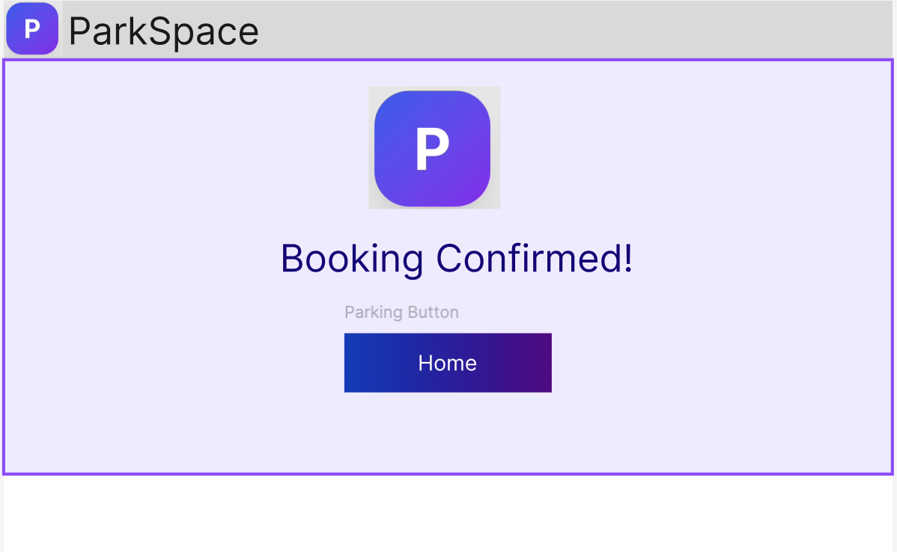

# SW Engineering CSC648-848-05 Summer 2025, T05: Parking Space Marketplace

# Milestone 3 V1

## Project/Application Title: Parking Space Marketplace

**Date:** July 22nd 2025

**Link to site:** `http://52.52.40.129:3000/`

---

### History Table

| Milestone | Version | Date           |
|-----------|---------|----------------|
| M3        | V1      | July 22nd 2025 |
| M2        | V2      | July 22nd 2025 |
| M2        | V1      | July 3rd 2025  |
| M1        | V2      | June 23rd 2025 |
| M1        | V1      | June 17th 2025 |

---

## Team

| Student | Full Name             | SFSU Email             | GitHub Username      | Discord Username      | Role(s)                      |
|:-------:|:---------------------:|:----------------------:|:--------------------:|:---------------------:|:-----------------------------:|
|    #1   | Stella Parker         | <sparker11@sfsu.edu>     | @whoIsStella         | latchkeykid           | Team-lead / Backend-Lead/GitHub Master/Scrum Master |
|    #3   | Nathaniel Moreno      | <nmoreno@sfsu.edu>       | @NateM03             | ba_daniels            | Database Administrator        |
|    #4   | Fatma Almosawi        | <falmosawi@sfsu.edu>     | @fatma-al            | fatma.almosawi        | Scrum Master                  |
|    #5   | Krishna Shenoy        | <920875953@sfsu.edu>     | @krishs44            | krishnashenoy_71520   | Technical Writer              |
|    #6   | Juan Daniel Ramirez   | <jramirez9@sfsu.edu>     | @JuanDanielRamirez   | juanramirez_05991     | Frontend Lead                 |
|    #7   | Julianna Embalzado    | <eembalzado@mail.sfsu.edu> | julianna-embalzado | jejemon6201           | Software Architect            |

---

### Table of Contents

1. [Data Definitions](#data-definitions)
2. [Prioritized High-Level Functional Requirements](#prioritized-high-level-functional-requirements)
3. [UI/UX Wireframes](#ui/ux-wireframes)  
4. [High-Level System Design](#high-level-system-design)  
5. [Key Project Risks](#key-project-risks)  
6. [Project Management](#project-management)  
7. [List of Team Contributions](#list-of-team-contributions)  

---

## Data Definitions

### User

| Attribute            | Type         | Constraints / Notes                                        |
| -------------------- | ------------ | ---------------------------------------------------------- |
| user\_id             | UUID/serial  | PK, unique, not null                                       |
| email                | VARCHAR(255) | unique, not null, must be valid email                      |
| password\_hash       | VARCHAR(255) | not null (argon2, salted)                                  |
| first\_name          | VARCHAR(100) | not null                                                   |
| last\_name           | VARCHAR(100) | not null                                                   |
| phone\_number        | VARCHAR(20)  | nullable, validated                                        |
| role                 | ENUM         | 'renter', 'owner', 'admin'; not null                       |
| mfa\_enabled         | BOOLEAN      | default: false                                             |
| is\_active           | BOOLEAN      | default: true                                              |
| created\_at          | TIMESTAMP    | auto-set                                                   |
| profile\_image\_url  | VARCHAR(300) | nullable; image (<5MB, jpg/png/webp, 512x512 max)          |
| address              | VARCHAR(255) | nullable; for owner payout/tax, user personalization       |
| vehicle\_license     | VARCHAR(20)  | nullable; for renters, validated, format: country-specific |
| accessibility\_needs | TEXT         | nullable; e.g., wheelchair access required                 |
| notification\_prefs  | JSON         |  email: true, sms: false, push: true           |

### Parking Space

| Attribute              | Type         | Constraints / Notes                                          |
| ---------------------- | ------------ | ------------------------------------------------------------ |
| space\_id              | UUID/serial  | PK, unique, not null                                         |
| owner\_id              | UUID         | FK to User, not null                                         |
| address                | VARCHAR(255) | not null, geocoded for map                                   |
| latitude               | FLOAT        | not null                                                     |
| longitude              | FLOAT        | not null                                                     |
| description            | TEXT         | not null, 1-1000 chars                                       |
| price\_per\_hour       | DECIMAL(6,2) | not null, >=0, USD                                           |
| price\_per\_day        | DECIMAL(6,2) | optional, >=0, USD                                           |
| is\_accessible         | BOOLEAN      | default: false (accessible features for ADA)                 |
| features               | JSON         | e.g., ev_charging: true, covered: true, size: "XL"     |
| images                 | JSON         | array of image URLs (<10, each <5MB, jpg/png/webp, 1024x768) |
| status                 | ENUM         | 'active', 'unlisted', 'pending', 'banned'                    |
| rules                  | TEXT         | nullable; e.g., “No overnight parking, call if late”         |
| created\_at            | TIMESTAMP    | auto-set                                                     |
| updated\_at            | TIMESTAMP    | auto-set                                                     |
| availability\_schedule | JSON         | e.g., mon:[8-18], tue:[8-18], ...     |

### Booking

| Attribute            | Type         | Constraints / Notes                                        |
| -------------------- | ------------ | ---------------------------------------------------------- |
| booking\_id          | UUID/serial  | PK, unique, not null                                       |
| space\_id            | UUID         | FK to ParkingSpace, not null                               |
| renter\_id           | UUID         | FK to User, not null                                       |
| owner\_id            | UUID         | FK to User, not null                                       |
| start\_time          | TIMESTAMP    | not null, UTC                                              |
| end\_time            | TIMESTAMP    | not null, UTC                                              |
| status               | ENUM         | 'pending', 'confirmed', 'canceled', 'completed', 'no-show' |
| amount\_total        | DECIMAL(6,2) | not null, >=0, USD                                         |
| payment\_id          | UUID         | FK to Payment, nullable (pending booking)                  |
| cancellation\_reason | VARCHAR(255) | nullable                                                   |
| created\_at          | TIMESTAMP    | auto-set                                                   |
| last\_updated        | TIMESTAMP    | auto-set                                                   |
| review\_left         | BOOLEAN      | default: false                                             |

### Payment

| Attribute           | Type         | Constraints / Notes                                      |
| ------------------- | ------------ | -------------------------------------------------------- |
| payment\_id         | UUID/serial  | PK, unique, not null                                     |
| booking\_id         | UUID         | FK to Booking, not null                                  |
| user\_id            | UUID         | FK to User, payer (usually renter), not null             |
| amount              | DECIMAL(6,2) | not null, >=0, USD                                       |
| status              | ENUM         | 'pending', 'succeeded', 'failed', 'refunded', 'disputed' |
| payment\_method\_id | UUID         | FK to PaymentMethod, not null                            |
| created\_at         | TIMESTAMP    | auto-set                                                 |
| refunded\_at        | TIMESTAMP    | nullable                                                 |
| transaction\_ref    | VARCHAR(100) | Stripe/PayPal reference, unique                          |

### Payment Method

| Attribute           | Type         | Constraints / Notes                             |
| ------------------- | ------------ | ----------------------------------------------- |
| payment\_method\_id | UUID/serial  | PK, unique, not null                            |
| user\_id            | UUID         | FK to User, not null                            |
| card\_brand         | VARCHAR(20)  | 'Visa', 'MasterCard', 'Amex'; or 'PayPal' |
| last4               | VARCHAR(4)   | not null                                        |
| expiry\_month       | INT          | 1-12                                            |
| expiry\_year        | INT          | four-digit year                                 |
| is\_default         | BOOLEAN      | default: false                                  |
| token               | VARCHAR(255) | Encrypted; never store raw PAN                  |
| created\_at         | TIMESTAMP    | auto-set                                        |

### Message

| Attribute       | Type         | Constraints / Notes                          |
| --------------- | ------------ | -------------------------------------------- |
| message\_id     | UUID/serial  | PK, unique, not null                         |
| sender\_id      | UUID         | FK to User, not null                         |
| recipient\_id   | UUID         | FK to User, not null                         |
| booking\_id     | UUID         | FK to Booking, nullable (general or support) |
| content         | TEXT         | not null, 1-2000 chars, profanity check      |
| sent\_at        | TIMESTAMP    | auto-set                                     |
| is\_flagged     | BOOLEAN      | default: false                               |
| flagged\_reason | VARCHAR(100) | nullable, e.g., 'abusive', 'spam'            |

### Review

| Attribute    | Type        | Constraints / Notes            |
| ------------ | ----------- | ------------------------------ |
| review\_id   | UUID/serial | PK, unique, not null           |
| author\_id   | UUID        | FK to User, not null           |
| booking\_id  | UUID        | FK to Booking, not null        |
| target\_type | ENUM        | 'user', 'space'                |
| target\_id   | UUID        | FK to User or ParkingSpace     |
| rating       | INT         | 1-5 stars, not null            |
| comment      | TEXT        | nullable, 1-1000 chars         |
| created\_at  | TIMESTAMP   | auto-set                       |
| is\_visible  | BOOLEAN     | default: true (admin can hide) |

### AdminAction

| Attribute    | Type        | Constraints / Notes                                |
| ------------ | ----------- | -------------------------------------------------- |
| action\_id   | UUID/serial | PK, unique, not null                               |
| admin\_id    | UUID        | FK to User (admin), not null                       |
| user\_id     | UUID        | FK to User, nullable (target)                      |
| action\_type | ENUM        | 'ban', 'warn', 'refund', 'edit', 'resolve\_ticket' |
| reason       | TEXT        | not null, 1-500 chars                              |
| created\_at  | TIMESTAMP   | auto-set                                           |

### ServiceRequest

| Attribute     | Type        | Constraints / Notes                               |
| ------------- | ----------- | ------------------------------------------------- |
| request\_id   | UUID/serial | PK, unique, not null                              |
| booking\_id   | UUID        | FK to Booking, not null                           |
| user\_id      | UUID        | FK to User, not null                              |
| service\_type | ENUM        | 'roadside', 'unlock', 'other'                     |
| status        | ENUM        | 'pending', 'in\_progress', 'resolved', 'canceled' |
| created\_at   | TIMESTAMP   | auto-set                                          |
| resolved\_at  | TIMESTAMP   | nullable                                          |
| notes         | TEXT        | nullable                                          |

### EarningsDashboard _this can be matiealized or agrigated_

| Attribute       | Type          | Constraints / Notes                       |
| --------------- | ------------- | ----------------------------------------- |
| owner\_id       | UUID          | FK to User, not null                      |
| period          | ENUM          | 'daily', 'weekly', 'monthly', 'all\_time' |
| total\_earnings | DECIMAL(10,2) | not null, USD                             |
| num\_bookings   | INT           | not null                                  |
| last\_updated   | TIMESTAMP     | auto-set                                  |

### Notification

| Attribute        | Type        | Constraints / Notes                                |
| ---------------- | ----------- | -------------------------------------------------- |
| notification\_id | UUID/serial | PK, unique, not null                               |
| user\_id         | UUID        | FK to User, not null                               |
| type             | ENUM        | 'booking', 'payment', 'cancel', 'support', 'alert' |
| content          | TEXT        | not null, 1-500 chars                              |
| is\_read         | BOOLEAN     | default: false                                     |
| sent\_at         | TIMESTAMP   | auto-set                                           |

---

## Prioritized High-Level Functional Requirements

### Priority 1

#### 1. Renter

**Section 1.1: Searching and Viewing Parking Spaces**

- 1.1.1 The renter shall be able to search for parking spaces by address.
- 1.1.2 The renter shall be able to search for parking spaces by date and time.
- 1.1.3 The renter shall be able to view parking spaces on an interactive map.

**Section 1.2: Booking and Payment**

- 1.2.1 The renter shall be able to create a booking for a selected parking space.
- 1.2.2 The renter shall be able to select the desired date and time for the booking.
- 1.2.3 The renter shall be able to pay for a booking using multiple payment methods.
- 1.2.4 The renter shall be able to save, update, and remove payment methods from their account.
- 1.2.5 The renter shall be able to receive payment confirmations and notifications regarding the status of their booking.
- 1.2.6 The renter shall be able to cancel a booking, subject to the applicable refund policy.

**Section 1.4: Profile and Communication**

- 1.4.3 The renter shall be able to message the parking space owner about a booking.

#### 2. Owner

**Section 2.1: Listing and Managing Parking Spaces**

- 2.1.1 The owner shall be able to create a new parking space listing by providing address, photos, description, amenities, accessibility features, and pricing.
- 2.1.2 The owner shall be able to set and edit availability windows for each parking space.
- 2.1.3 The owner shall be able to update details or remove an existing parking space listing.

**Section 2.2: Managing Bookings and Earnings**

- 2.2.1 The owner shall be able to view and manage all bookings for their parking spaces.
- 2.2.2 The owner shall be able to accept or decline incoming booking requests.
- 2.2.5 The owner shall be able to update their banking/payment information to receive payouts.

**Section 2.3: Communication and Reviews**

- 2.3.3 The owner shall be able to set specific rules for each parking space.

**Section 2.4: Profile and Support**

- 2.4.1 The owner shall be able to update their profile and contact details.

#### 3. Admin

**Section 3.1: User and Content Management**

- 3.1.1 The admin shall be able to view and manage all user accounts (renters, owners, admins).
- 3.1.2 The admin shall be able to suspend or ban user accounts as needed.
- 3.1.3 The admin shall be able to monitor and moderate user-generated content, including listings, messages, reviews, and booking records.
- 3.1.4 The admin shall be able to flag, remove, or edit inappropriate content or reviews.
- 3.1.5 The admin shall be able to handle disputes between users and perform admin actions (warnings, penalties, etc.).

**Section 3.2: Payments and Analytics**

- 3.2.1 The admin shall be able to view and manage all payments and transactions.
- 3.2.2 The admin shall be able to issue refunds and adjust commission or platform fees.
- 3.2.3 The admin shall be able to generate financial reports, analytics, and usage metrics.
- 3.2.4 The admin shall be able to monitor system health and performance.

#### 4. All Users

**Section 4.1: Account Management and Access**

- 4.1.1 All users shall be able to register for an account.
- 4.1.2 All users shall be able to log in securely.
- 4.1.3 All users shall be able to reset a forgotten password.
- 4.1.4 All users shall be able to delete their account.

**Section 4.2: General Features**

- 4.2.2 All users shall be able to view the privacy policy and terms of service.
- 4.2.3 All users shall be able to manage notification preferences.

---

### Priority 2

#### 1. Renter

**Section 1.1: Searching and Viewing Parking Spaces**

- 1.1.5 The renter shall be able to sort parking space search results by relevance, price, or distance.
- 1.1.6 The renter shall be able to view detailed information for each parking space, including photos, description, accessibility features, and owner-defined rules.

**Section 1.3: Managing Bookings and Reviews**

- 1.3.1 The renter shall be able to view a list of upcoming and past bookings.
- 1.3.2 The renter shall be able to extend an active booking, subject to availability.
- 1.3.3 The renter shall be able to leave a review for a completed booking or parking space.
- 1.3.4 The renter shall be able to report issues with a parking space or booking.

**Section 1.4: Profile and Communication**

- 1.4.1 The renter shall be able to update their profile information (contact details, vehicle info, accessibility needs).
- 1.4.2 The renter shall be able to manage notification preferences (receive booking reminders, payment alerts via app/email/SMS).

#### 2. Owner

**Section 2.1: Listing and Managing Parking Spaces**

- 2.1.4 The owner shall be able to temporarily unlist a parking space from the marketplace.

**Section 2.2: Managing Bookings and Earnings**

- 2.2.3 The owner shall be able to receive booking notifications and cancellation alerts.
- 2.2.4 The owner shall be able to access an Earnings Dashboard displaying income by period and booking history.

#### 3. Admin

**Section 3.3: Platform Settings and Policies**

- 3.3.1 The admin shall be able to update platform terms, conditions, and privacy policy.
- 3.3.2 The admin shall be able to configure notification and penalty settings.

#### 4. All Users

**Section 4.2: General Features**

- 4.2.1 All users shall be able to access the help center or FAQ.

---

### Priority 3

#### 1. Renter

**Section 1.1: Searching and Viewing Parking Spaces**

- 1.1.4 The renter shall be able to filter parking spaces by price, distance, amenities (e.g., EV charging, covered), vehicle size compatibility, and accessibility status.

**Section 1.4: Profile and Communication**

- 1.4.4 The renter shall be able to access help resources and submit a support ticket for technical or customer support.

**Section 1.5: Special Features**

- 1.5.1 The renter shall be able to request roadside assistance (ServiceRequest) if experiencing car trouble during an active booking.
- 1.5.2 The renter shall be able to receive navigation directions to the parking space location.

#### 2. Owner

**Section 2.3: Communication and Reviews**

- 2.3.1 The owner shall be able to message renters about bookings.
- 2.3.2 The owner shall be able to review renters after completed bookings.

**Section 2.4: Profile and Support**

- 2.4.2 The owner shall be able to submit support tickets for customer or technical support.

---

## UI/UX Wireframes

### Use Case 1: List a Parking Space

Owner uploads info, sets price, and posts availability. If the info is incomplete, app prompts for missing data.

1. User arrives to Landing Page.

2. User Lists a Parking Space, which requires an account.

3. User fills relavent information on parking spot.

4. Parking spot is confirmed for user.

Note: Prototype can only move across other screens by pressing relavent buttons. No other functionality has been implemented.
[Figma prototype link](https://www.figma.com/proto/TgTctzgJgg4SWZn4Thq4ka/Use-Case-1?node-id=0-1&t=Ja8rnrCBGujVaUQL-1)

---

### Use Case 2: List a Parking Space

Renter enters location, desired time. System shows nearby available spots on a map. If no spaces found, System suggests adjusting filters or dates.

1. User arrives at the landing page.

2. User signs in.

3. User enters destination

[Figma prototype link](https://www.figma.com/proto/TgTctzgJgg4SWZn4Thq4ka/Wireframes?node-id=72-109&t=kBvrWhHS0SsZpBLD-1)

---

### Use Case 3

Renter selects a spot, reviews details, and confirms booking. If payment fails, System prompts renter to retry or choose a different method.

1. User clicks find booking tab and sees the available listings nearby with Google Maps showing.

2. The user sees the details of the parking spot and confirms the booking with the card already on file. But is prompted with a failed payment attempt

3. The user retries the payment method, and the booking is confirmed.

[Figma prototype link](https://www.figma.com/proto/ZkByYnUy7o5a9zw7MH6XUe/Untitled?node-id=1-7&p=f&t=GaCOPF9btbzHh6p4-1&scaling=min-zoom&content-scaling=fixed&page-id=0%3A1)

---

### Use Case 4: Cancel a Booking

Renter or owner cancels before start time; system notifies the other party. If cancellation is too close to start, app enforces cancellation policy.

1. The renter goes to his bookings to cancel a booking before the start time.

2. Renter sees his bookings and selects cancel on the one he wants to cancel, but is told it is less than a 24-hour notice and will still be charged the cancellation fee, it then states the other party (owner) will be notified.

[Figma prototype link](https://www.figma.com/proto/lO5zwkhSXOPDxv1qx7QKXK/Use-Case-4_Work_Frame?node-id=22-38&p=f&t=tq7Pmw2TUX7zCF7V-1&scaling=min-zoom&content-scaling=fixed&page-id=1%3A2)

---

### Use Case 5

Renter and owner communicate about arrival or specific instructions. If inappropriate messages are detected, admin is alerted.

1. Owner gets a message from the renter about a miscommunication regarding the lot availability.

2. Renter becomes unhappy because the lot is not available yet.

3. Renter violates community guidelines and the owner can safely block the user and cancel their service.

[Figma prototype link](https://www.figma.com/proto/a0NpAxw9OTuyJc2zUJPBSE/Wireframes--Copy-?node-id=2006-531&p=f&t=TvSEcpkIoLUycC1q-1&scaling=min-zoom&content-scaling=fixed&page-id=2002%3A271)

---

### Use Case 6: Owner Reviews bookings and Earnings

Owner checks upcoming/past bookings and income dashboard. If dashboard fails to load, app displays support contact.

1. Ownwer Dashboard Interface: Owners Point of View

2. Owner Dashboard Interface: Owner's point of view, hover tool-tip to generate report.

3. Ownwer Dashboard Interface: Owners point of view, 404 error.

4. Chat Interface: Owner's point of view, interacting with customer support.

1. Owner Dashboard Interface: Owners point of view, YTD earnings report successfully generated.

[Figma prototype link](https://www.figma.com/proto/a0NpAxw9OTuyJc2zUJPBSE/Wireframes--Copy-?node-id=2021-184&p=f&t=jLq4z1yubKHIPm0L-1&scaling=min-zoom&content-scaling=fixed&page-id=2001%3A17&starting-point-node-id=2021%3A184)

---

### Use Case 7: User Profile Management

User updates personal info, payment details, or preferences. If invalid info is entered, app requests corrections.

1. User opens account settings.

2. User can see information on account settings.

3. User edits information on account settings.

4. User sees confirmation that changes are made successfully.

[Figma Prototype Link](https://www.figma.com/proto/GHQzqtmbrefRDwCMFYcFkh/Use-Cases?node-id=0-1&t=xrZh1cc6bUYfVGmz-1)
---

### Use case 8

Renter finds nearby parking for late night shifts. If no safe spot is available, app suggests alternative options.

1. User searches for parking nearby.

2. User filters the search to include safety features.

3. User gets list of refined results.

4. User clicks on a spot to get more details.

5. User fills in payment info.

6. User gets confirmation message.

[Figma prototype link](https://www.figma.com/proto/euoVE4xqXbbVdHIf96GzSh/UseCase8?node-id=0-1&t=yaIdHo0FpeZkNFgC-1)

---

### Use case 9

Renter with mobility challenges secures a nearby accessible parking spot. If no accessible spot is found, Stystem suggests the closest available options.

1. User sees the landing page of the website

2. User goes to the Sign in page

3. User sees the search page of different parking spots available to rent

4. User books the parking spot

5. User sees confirmation that booking was successful

[Figma Prototype Link](https://www.figma.com/proto/GHQzqtmbrefRDwCMFYcFkh/Use-Cases?node-id=5-6025&t=rcNlItLQI4WeQJFb-1)

---

### Use Case 10: Car trouble in currently rented parking space

Renter requests roadside assistance when experiencing car trouble. System charges for extended stay, notifies spot owner of delay, and updates both parties when the spot is available again.

1. Renter/user is having car trouble and navigates through the application, choosing "Roadside service" located at the top right of the screen.

2. Renter/user fills out all the designated boxes with their information on the request. When they are done they will click "Request Assistance" located at the bottom right of the screen.  

3. System processes the renter/user's request and will let owner know about this delay and charge the renter/user for the extra time they will be on the owner's property.

[Figma prototype link](https://www.figma.com/proto/5GfvM2d4g0DMdtHbKf8vyJ/Use-case-10?node-id=0-1&t=QELkUpakjgN3oUyg-1)

---

## High-Level System Design

### High-Level Database Architecture

- **Entity-Relationship Diagram (ERD):**

- **Enhanced Entity-Relationship (EER) Diagram:**
  

### Backend Architecture

---
