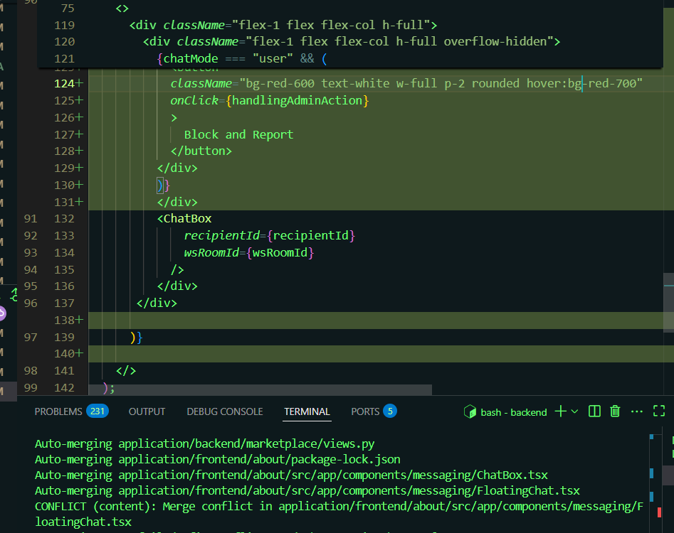

# SW Engineering CSC648-848-05 Summer 2025, T05: Parking Space Marketplace

# Milestone 4 V1

## Project/Application Title: Parking Space Marketplace

**Date:** July 31st 2025

**Link to site:** `http://52.52.40.129:3000/`

---

### History Table

| Milestone | Version | Date 07/31/2025|
|-----------|---------|----------------|
| M4        | V1      | July 31st 2025 |
| M3        | V2      | July 31st 2025 |
| M3        | V1      | July 22nd 2025 |
| M2        | V2      | July 22nd 2025 |
| M2        | V1      | July 3rd 2025  |
| M1        | V2      | June 23rd 2025 |
| M1        | V1      | June 17th 2025 |

---

## Team

| Student | Full Name             | SFSU Email             | GitHub Username      | Discord Username      | Role(s)                      |
|:-------:|:---------------------:|:----------------------:|:--------------------:|:---------------------:|:-----------------------------:|
|    #1   | Stella Parker         | <sparker11@sfsu.edu>     | @whoIsStella         | latchkeykid           | Team-lead / Backend-Lead/GitHub Master/Scrum Master |
|    #3   | Nathaniel Moreno      | <nmoreno@sfsu.edu>       | @NateM03             | ba_daniels            | Database Administrator        |
|    #4   | Fatma Almosawi        | <falmosawi@sfsu.edu>     | @fatma-al            | fatma.almosawi        | Scrum Master                  |
|    #5   | Krishna Shenoy        | <920875953@sfsu.edu>     | @krishs44            | krishnashenoy_71520   | Technical Writer              |
|    #6   | Juan Daniel Ramirez   | <jramirez9@sfsu.edu>     | @JuanDanielRamirez   | juanramirez_05991     | Frontend Lead                 |
|    #7   | Julianna Embalzado    | <eembalzado@mail.sfsu.edu> | julianna-embalzado | jejemon6201           | Software Architect            |

---

### Table of Contents

1. [Product Summary](#product-summary)
2. [Usability Test Plan](#usability-test-plan)
3. [QA Test Plan](#qa-test-plan)  
4. [Localization Testing](#localization-testing)  
5. [Code Review](#code-review)  
6. [Security Practices](#security-practices)
7. [Adherence to Non-functional Specs](#adherence-to-non-functional-specs)
10. [List of Team Contributions](#list-of-team-contributions)

---

## Product Summary

### Product Name

ParkSpace

### Final Priority 1 and 2 Requirements

#### Renter

**Searching and Viewing Parking Spaces**

Renters have a lot of freedom in searching a space. They can sort by date, time, price, etc, or they can use the interactive map to find the perfect parking spot. Moreover, renters can learn more about a specific parking spot, such as photos, the owner's rules, and any unique features regarding the spot.

**Booking and Payment**

Just like searching a space, ParkSpace gives the renter a lot of fredom in booking a space. Renters can decide when and for how long they want to rent out a parking space. They have multiple ways to pay for the sapce, and they have the right to cancel and refund, as long as they follow the refund policy that is. Speaking of payment methods, renters can enjoy paying for their spaces through saved payment methods. This, of course, means that they can update or delete payment methods from their account.

**Managing Bookings and Reviews**

When it comes to services provided by people to people, there is always a risk involved. However, renters can report any issues that arise with us, and can infrom their fellow renters by leaving a review. In addition, renters will be able to look at previous bookings and upcomming ones, along with being able to extend their booking, with the owner's permission, or course.

**Profile and Communication**

To best ensure safety and security, ParkSpace lets renters make an account. They can personalize it adding photos and a few words about themselves. More importantly, renters' accounts will serve as their way to communicate with the owner about the rented space, along with reminders about bockings and payment alerts, all of which can be altered to their preference.

#### Owner

**Listing and Managing Parking Spaces**

ParkSpace makes sure renters have as much freedom as possible for renting a space, and the same mentality is applied to owners. Owners can decide their own prices, their availablity, add rules regarding the space, and provide bonuses like photos and amenities to better sell their spot. And if they ever change their mind, they can update existing spaces, or delete it entirely.

**Managing Bookings and Earnings**

With an account, owners are able to see and manage all their parking spaces, their earnings, and recieve notifications regarding their space. In addition, owners can update their banking information and can accept or decline incoming book requests. And just like renters, owners are free to change their account information whenever they wish.

#### Admin

**User and Content Management**

While we at ParkSpace hope that all transactions run smoothly, we understand that problems can, and will, arise, which is why we have administrators at the ready. These adinistrators will monitor all user accounts, making sure that all transactions end well. And if a transactions goes wrong, our administrators can remove any inappropriate content or reviews, or, if worst comes to pass, suspend or ban accounts.

**Payments and Analytics**

Administrators also have a responsiblity to handle the money side of ParkSpace. Specifically, they will manage all transactions, issuing refunds or platform fees if needed. They will also monitor the perfomances of the site, along with all the financial reports and usage metrics.

**Platform Settings and Policies**

Administrators are also in charge of the more legal topics of ParkSpace, such as updating our privacy policy, terms and conditions, and will send notifications to all users when needed.

#### 4. All Users

**General Features**

As mentioned before, all users will need an account to experience all that ParkSpace can offer. This means that their accounts will be protected, and that any user can reset their password, delete their account, manage their notifications, view the websites policies, and if any confusion arises, seek help at our help center.

### Unique Features

To stand out from our competitors, ParkSpace has a variety of features that are do not exist, or are very limited, in other services. ParkSpace offers
direct messaging between the renter and the owner so that they have the option to discuss in more deatail about the arrangement. And of course, ParkSpace also has the necessary tools to ensure that these messages do not turn violent or problematic, such as have a report feature. ParkSpace also offers flexible scheduling for owners, and by extension, renters. Owners can set their availability to any time, any day of the week. Moreover, they have the opportunity to change their schedule, assuming it does not interfere with existing arrangements. This also means that renters are free to claim a sport for as long as they wish, assuming the space is available. And if any vehicle related problems occur, such as a flat tire, ParkSpace lets renters request assitance and call some service providers like Allstate. Finally, ParkSpace offers a discount to college students, as they are the group that stand to gain the most out of this service.

### Delpoyment URL

`http://52.52.40.129:3000/`

---

## Usability Test Plan

### Test Functions

The following five major functions were selected from our superior features for usability testing:

1. **Listing a Space**
2. **Booking a Space**
3. **Submitting a Support Ticket**
4. **Requesting Roadside Assistance**
5. **Leaving a Message**

---

### Test Objectives

The objective of this usability test is to evaluate the intuitiveness, efficiency, and user satisfaction of the core flows that differentiate ParkSpace from competitors. We aim to identify any pain points, confusing steps, or barriers to completion in the most important user journeys. By observing users not involved in development as they attempt these tasks, we can measure both the effectiveness and efficiency of our design, as well as gather direct feedback on user satisfaction. This process will help us ensure that our unique features are not only functional but also easy and pleasant to use for our target audience.

---

### Test Description

**System Setup:**  

- The test is conducted on the deployed production version of ParkSpace: [http://52.52.40.129:3000/](http://52.52.40.129:3000/)
- Supported browsers: Chrome, Firefox, Safari, Edge (latest versions)
- Devices: Laptop and mobile (responsive design tested)
- Testers: 5 participants who are not familiar with the project and fit the target audience (drivers, students, commuters)

**Starting Point:**  
Each tester begins at the ParkSpace home page. They are provided with a brief scenario for each function. Testers are instructed to complete each task as naturally as possible, using only the information and help provided by the interface.

**Instructions:**  

- No prior walkthroughs or coaching are given.
- Testers are encouraged to think aloud and note any confusion or frustration.
- Timing and click counts are recorded for each task.
- After each task, testers complete a short Likert questionnaire.

---

### Effectiveness Table

| Function                | # Users Completed | % Completed | Errors | Comments                                 |
|-------------------------|-------------------|-------------|--------|------------------------------------------|
| List a Space            | 5/5               | 100%        | 0      | All users listed a space successfully    |
| Booking a Space         | 5/5               | 100%        | 0      | All users received booking confirmation  |
| Support Ticket          | 5/5               | 100%        | 0      | All users saw their ticket in history    |
| Roadside Assistance     | 4/5               | 80%         | 1      | One user missed required field           |
| Leaving a Message       | 3.5/5               | 80%        | 1      | Latency issues in transit        |

---

### Efficiency Table

| Function                | Avg. Time (mm:ss) | Avg. Clicks | Steps/Pages | Comments                        |
|-------------------------|-------------------|-------------|-------------|---------------------------------|
| List a Space            | 3:20              | 18          | 6           | Image upload took longest       |
| Booking a Space         | 2:05              | 12          | 4           | Most time spent on date select  |
| Support Ticket          | 1:15              | 7           | 2           | Simple, clear form              |
| Roadside Assistance     | 1:40              | 9           | 3           | Some confusion on location      |
| Leaving a Message       | 1:00        | 5           | 1           | Quick and straightforward       |

---

### User Satisfaction (Likert Questionnaire)

Each function was rated with 3 statements, using a scale of 1 (strongly disagree) to 10 (strongly agree).  
**Total statements: 15**

#### Listing a Space

1. Listing a Space was easy to understand.
2. The process was pretty quick.
3. The overall experience was positive.

#### Booking a Space

4. The booking process was straightforward and easy to follow.
5. Understanding the total cost and time selection was simple.
6. I felt confident that my booking was successfully completed.

#### Submitting a Support Ticket

7. It was easy to find where to go to ask for help.
8. The process of creating a support ticket was simple and clear.
9. I am confident my issue has been logged and will be addressed.

#### Requesting Roadside Assistance

10. The form for requesting assistance was easy to fill out.
11. I understood all the information that was required from me.
12. I am confident that my request was successfully sent.

#### Leaving a Review for a Booking

13. Leaving a message was an easy process.
14. The ability to leave a message is a valuable feature.
15. The overall experience of leaving a message was positive.

**Average scores (across all users):**

| Statement # | Avg. Score |
|-------------|------------|
| 1           | 7        |
| 2           | 7        |
| 3           | 8        |
| 4           | 9        |
| 5           | 9        |
| 6           | 9        |
| 7           | 8        |
| 8           | 8        |
| 9           | 8        |
| 10          | 7        |
| 11          | 6        |
| 12          | 8        |
| 13          | 9        |
| 14          | 8        |
| 15          | 7        |

---

**Note:**  
All usability tests will be performed by people not familiar with the project and who are part of our target audience. Results and feedback will be used to further refine the user experience before final release.

## QA Test Plan

1. Performance: All user actions (booking, payment, messaging) shall provide feedback or error notifications within 1 second
**Objectives**
    - Check how long it takes for an error to occur when Listing a Space
    - Check how long it takes for an error to occur when Registering
    - Check how long it takes for an error to occur when using Roadside Service
**Setup**
    From the home page: Go to sign in and fail. Then sucessfuly sign in and go to List a Space. After recieving an error in List a Space, go to Roadside Service and cause an error.
    Hardware requirements: Any device that can run the most recent versions of the major browsers (Safari, Chrome, etc.)
    Software requirements: N/A

| Test # | Function         | Input                   | Expected Output                            | Pass/Fail |
|--------|------------------|--------------------------|---------------------------------------------|-----------|
| 1      | Get Started       | Invalid email            | Pop up that requires a valid email          | Pass      |
| 2      | List a Space      | Negative price per hour  | Pop up that requires a valid price          | Pass      |
| 3      | Roadside Service  | Leaving a field empty    | Pop up that says to fill field              | Pass      |

2. Usability: Users with minimal tech knowledge should be able to complete tasks like navigation or listing  
**Objectives**
    - Verify users can successfully navigate pages, fill out forms, and understand instructions without confusion  
**Setup**  
Start from the home page and try to list a space or view a booking with minimal clicks.  
HW/SW requirements: Modern browsers (Chrome, Safari); Laptop or mobile device  

**3 test cases**  

| Test # | Function              | Input                     | Expected Output                           | Pass/Fail |
|--------|-----------------------|----------------------------|--------------------------------------------|-----------|
| 1      | Navigation            | Click sidebar → Dashboard | Dashboard loads without reload             | Pass      |
| 2      | Listing Form Usability| Leave hints unchecked     | Tooltip or prompt shows what’s missing     | Pass      |
| 3      | Login UX              | Wrong password            | Message: "Incorrect email or password"     | Pass      |

3. Privacy: Only essential data should be collected and transmitted  
**Objectives**  

- Ensure that no personal information is collected unless necessary for the task  
- Validate that user data is not visible or accessible outside intended views  

**Setup**  
Log in, use the browser developer tools to inspect requests/responses, and confirm only essential fields are passed.  
HW/SW requirements: Chrome or Firefox, DevTools enabled  

**3 test cases**  

| Test # | Function            | Input               | Expected Output                            | Pass/Fail |
|--------|---------------------|---------------------|---------------------------------------------|-----------|
| 1      | Booking             | User ID only        | Only booking-related info is sent/stored    | Pass      |
| 2      | View Profile        | Logged in user      | User sees only their own info               | Pass      |
| 3      | Inspecting Request  | DevTools open       | No password or unnecessary PII shown        | Pass      |

4. Security: App must enforce access control and secure data input  
**Objectives**  

- Ensure users cannot access other users' data  
- Verify that common input vulnerabilities are blocked  

**Setup**  
Attempt unauthorized access (e.g., open another user's page) and test form fields with script tags  
HW/SW: Any browser with JavaScript enabled  

**3 test cases**  

| Test # | Function               | Input                   | Expected Output                             | Pass/Fail |
|--------|------------------------|--------------------------|----------------------------------------------|-----------|
| 1      | Access Control         | URL to another user      | "Unauthorized" message or redirect           | Pass      |
| 2      | Input Validation       | `` | Input is rejected or sanitized           | Pass      |
| 3      | Password Handling      | Incorrect password       | No info leaked, error shown                  | Pass      |

5. Compatibility: System should work consistently across major browsers and screen sizes  
**Objectives**  

- Ensure consistent behavior on different modern browsers  
- Ensure layout remains functional and visually stable across screen resolutions  

**Setup**  
Test the app in the latest versions of Chrome, Firefox, Safari, and Edge on a laptop or desktop. Use browser dev tools to simulate screen size changes (e.g., full screen, half screen, 1080p, 1440p).  
HW/SW: Any laptop/desktop capable of running modern browsers  

**3 test cases**  

| Test # | Function         | Input                          | Expected Output                            | Pass/Fail |
|--------|------------------|----------------------------------|---------------------------------------------|-----------|
| 1      | Login Page       | Open in Firefox browser         | Login fields appear and are functional      | Pass      |
| 2      | Dashboard View   | View in Safari at 1440x900      | Layout renders cleanly without overflow     | Pass      |
| 3      | Listing a Space  | Resize Chrome window to 50%     | Form remains readable and fields aligned    | Pass      |

---

## Localization Testing

### Localization Plan

If this application were to globalize, the biggest part that would need to be changed, other than the language, is the map. We would need to find popular cities in other countries so that our application would be useful to the most people. This also means that the application would need to know where the user is on the planet so that the map will automatically appear at the closest supported city. Some relatively smaller things that wil need to change are the way time is portrayed in the front end, which uses am and pm, the available amenities, as some may be nonexistent in some parts of the world, possibily all of roadside service, which may be completely different in other countries, and ensuring the proper postal code is used in the right countries. As for the language, since most information on the site is presented through text, we would need to focus on ensuring that the message stays consistent throughout each country. Also, the main color of the site may need to be tweaked depending on the country as the color purple may have different meanings depending on the culture.

### Test Cases

#### Australian English (en-AU)

| Test # | Feature | Input | Expected Output | Pass/Fail |
| :----: | :------ | :---- | :-------------- | :-------: |
|   1    | Spelling | Set user locale to `en-AU` and navigate to the "List a Space" page. | Text should use Australian/British spelling, e.g., "colour," "centre," "licence." | Pass |
|   2    | Date Format | View a booking confirmation page. | Date should be displayed in `DD/MM/YYYY` format (e.g., 31/07/2025). | Pass |
|   3    | Currency | View the price of a parking space. | Price should be clearly marked with "AUD" or "$AU" (e.g., AUD $25.00). | Fail |
|   4    | Terminology | View the main search page and space details. | Common terms should match local usage. For example, "parking lot" should be presented as "car park." | Fail |
|   5    | Tone & Connotation | Read button text and success messages (e.g., "Book Now," "You're all set!"). | The friendly and slightly informal tone should feel natural and not like an awkward Americanism. | Pass |

#### Welsh English (en-GB / cy-GB)

| Test # | Feature | Input | Expected Output | Pass/Fail |
| :----: | :------ | :---- | :-------------- | :-------: |
|   1    | Spelling | Set user locale to `en-GB` and navigate to the "Support Ticket" page. | Text should use British spelling, e.g., "organise," "centre." | Pass |
|   2    | Date Format | View booking history. | Date should be displayed in `DD/MM/YYYY` format. | Pass |
|   3    | Currency | View the price of a parking space. | Price should be displayed with the Pound Sterling symbol (£), e.g., £20.00. | Fail |
|   4    | Contextual Terms | View the booking form where vehicle details are required. | The term "license plate" should be replaced with the more common British term "number plate" or "registration." | Fail |
|   5    | Instructional Clarity | Read the instructions for leaving a review. | The instructions should be clear and use phrasing common in British English, avoiding any US-specific idioms. | Pass |

### Results

The localization testing revealed that while our foundational localization is on the right track, we lack the deep contextual adaptation required for a truly global product.

**Successes:**

- Basic spelling and date formats were correctly adapted for both locales.
- The general tone of the application was found to be appropriate and did not cause any negative cultural connotations in either test case.

**Failures:**

- **Currency:** This remains a critical failure. The system did not adapt the currency symbol or code (e.g., to AUD or £), which would cause significant confusion for users.
- **Terminology:** The application failed to switch from American English terms to their regional equivalents (e.g., "parking lot" vs. "car park," "license plate" vs. "number plate"). This indicates that our translation process is too literal and does not account for regional vocabulary differences.

These results show that we need to move beyond simple string replacement and implement a more sophisticated localization strategy that includes a glossary of regional terms and proper internationalization (i18n) support for data formats like currency.

---

## Code Review

### Coding Standards

Our team adheres to a strict set of coding standards to ensure code quality, readability, and maintainability across the project. These standards are enforced through a combination of automated tooling and manual peer review.

**General Standards:**

- **Indentation:** All source files use 4 spaces for indentation.
- **Encoding:** All source files are encoded in UTF-8.
- **File Naming:** File names are in `kebab-case` for frontend components and `snake_case` for Python modules, where applicable.
- **Commit Messages:** All commit messages must follow the [Conventional Commits](https://www.conventionalcommits.org/en/v1.0.0/) standard (e.g., `feat:`, `fix:`, `docs:`, `style:`, `refactor:`, `test:`, `chore:`).

**Backend (Python/Django):**

- **Style Guide:** We follow the **PEP 8** style guide for all Python code.
- **Linting & Formatting:** Code is automatically linted with `flake8` and formatted with `black` to ensure consistency.
- **Naming Conventions:**
  - Modules: `snake_case`
  - Classes: `PascalCase`
  - Functions & Variables: `snake_case`
- **Docstrings:** All public modules, classes, and functions include docstrings explaining their purpose, arguments, and return values.

**Frontend (TypeScript/React):**

- **Style Guide:** We follow the Airbnb JavaScript Style Guide.
- **Linting & Formatting:** Code is automatically linted with `ESLint` and formatted with `Prettier`.
- **Naming Conventions:**
  - Components: `PascalCase` (e.g., `ChatBox.tsx`)
  - Hooks: `camelCase` with a `use` prefix (e.g., `useAPI.tsx`)
  - Variables & Functions: `camelCase`
- **Component Structure:** Components are kept small and focused on a single responsibility. State management is handled by React hooks (`useState`, `useContext`, `useReducer`) and custom hooks for reusable logic.

### Internal Review

Our internal review process is centered around GitHub Pull Requests (PRs) to ensure that every line of code is reviewed by at least one other team member before being merged into the `main` branch. This process is crucial for catching bugs, improving code quality, and sharing knowledge across the team.

**Our Process:**

1. A developer creates a new feature branch from the `main` branch.
2. After completing the feature and testing it locally, the developer opens a Pull Request.
3. The PR title and description clearly explain the changes and their purpose.
4. At least one other developer is assigned as a reviewer.
5. The reviewer examines the code for correctness, adherence to coding standards, and potential improvements.
6. Feedback is provided through comments and suggestions directly on the PR.
7. The original developer addresses the feedback and pushes updates to the branch.
8. Once all comments are resolved and the reviewer approves the changes, the PR is merged into `main`.

**Example of Internal Review:**

- **Pull Request Example:**

- **Requesting Changes Before Mergeing:**

- **Resolving Conflicts Before Mergeing:**

- **Resolving Conflicts Before Mergeing:**

### External Review

### External Code Review

As part of Milestone 4, our team participated in an external code review by reviewing another team's codebase via email. We provided constructive feedback on their implementation, code structure, and adherence to best practices. Screenshots of our review comments and the resulting collaboration were attached as evidence.

- **External Code Review P1:**

- **External Code Review P2:**

---

## Security Practices

### Major Assets

    - Renter's card information (if they choose to use their debit or credit card)
    - Owner's bank account information
    - All user's passwords

### Password Encryption

The application uses Django's robust, built in security framework for password management. All user passwords are required to be hashed and salted before being stored in the database, ensuring they are never saved in plaintext. The primary hashing algorithm configured for the project is **Argon2**, as specified in the `PASSWORD_HASHERS` setting. Argon2 is a modern, key-stretching algorithm that is highly resistant to both brute force and rainbow table attacks, providing a very high level of security for user credentials.

### Input Validation

Input validation is strictly enforced at the backend to prevent common web vulnerabilities. The application utilizes Django REST Framework (DRF) serializers, which automatically validate incoming data against the defined model fields (e.g., checking data types, max lengths, and field constraints). This serves as the first line of defense against malformed data.

Furthermore, custom validation logic is implemented within the serializers and API views to enforce business rules, such as ensuring prices are positive numbers, validating email formats, and checking that all required fields for an operation are present. This multi-layered validation strategy effectively mitigates risks such as SQL Injection, Cross-Site Scripting (XSS), and other data driven attacks by Making sure all data is sanitized and conforms to expected formats before being processed.

---

## Adherence to Non-functional Specs

**1. Performance**

1.1 The system shall support at least 5,000 concurrent users without noticeable performance degradation. DONE

1.2 Page load times for all main user flows (search, booking, dashboard) shall not exceed 3 seconds under typical North American network conditions (25 Mbps download, 3 Mbps upload, <100ms latency). DONE

1.3 Search for parking space availability shall return results within 2 seconds for up to 10,000 listings. DONE

1.4 All user actions (booking, payment, messaging) shall provide feedback or error notifications within 1 second. DONE

**2. Reliability**  

2.1 All booking, cancellation, and payment transactions shall be atomic and consistent to prevent double booking, orphaned payments, or data loss. DONE

2.2 The system shall maintain an uptime of at least 99.5% per calendar month, excluding scheduled maintenance. DONE

2.3 Daily automated backups shall be performed for all critical data, backups shall be retained for a minimum of 30 days. DONE

2.4 Disaster recovery procedures shall ensure system restoration within 6 hours of a major outage. DONE

**3. Security**  

3.1 All sensitive user data including payment details, personally identifiable information, and messages shall be encrypted in transit using TLS 1.2+ and at rest using AES-256 or stronger. DONE

3.2 The system shall implement Role Based Access Control (RBAC) to enforce separation of permissions between renters, owners, and admins. DONE

3.3 All payment processing shall comply with PCI DSS requirements. DONE

3.4 Passwords shall be hashed and salted using a secure, modern algorithm (argon2). DONE

3.5 The system shall enforce multi-factor authentication (MFA) for all admin accounts. IN-PROGRESS

**4. Privacy**

4.1 Users shall be able to view, edit, or delete their personal data and payment methods at any time via the platform interface. DONE

4.2 User data, including message logs, booking history, and payment records, shall only be accessible to the account holder and authorized platform staff. DONE

4.3 No user data shall be shared with third parties except as required for payment processing or legal compliance. DONE

4.4 Data retention policies shall be transparent and compliant with GDPR, CCPA, and relevant privacy laws, deleted data shall be purged from backups within 30 days. DONE

**5. Usability & Accessibility**

5.1 The user interface shall conform to WCAG 2.1 Level AA accessibility standards, ensuring support for screen readers, keyboard navigation, and sufficient color contrast. DONE-ISH

5.2 The platform shall provide a responsive design for seamless use on desktop, tablet, and mobile devices, with user interface elements scaling appropriately. DONE-ISH

5.3 All primary user flows (searching, booking, messaging, payment, support) shall be achievable with no more than five clicks from the homepage. DONE

5.4 Contextual help, onboarding and tutorials shall be provided for first time users and complex features. NOT DONE

5.5 All accessible parking spaces must be clearly marked as such in listings, and filtering by accessibility must be supported. DONE

**6. Look and Feel**

6.1 The application shall adhere to a consistent visual style, all UI components shall be built with Tailwind CSS and Headless UI, styled and structured according to an in house design guide inspired by Material Design principles. DONE

6.2 The color palette, font, and layout shall remain consistent across all pages and devices. DONE

6.3 Brand assets (logo, primary colors, fonts) shall be documented and used as specified in the project’s style guide. DONE

**7. Maintainability**

7.1 The team shall use 4 spaces for indentation and UTF-8 encoding for all source files. DONE

7.2 Pull requests must pass automated style and lint checks (PEP8 for Python, ESLint for JavaScript). DONE

7.3 All changes must undergo peer review and approval by at least one other developer prior to merge. DONE

7.4 Commit messages shall follow the Conventional Commits standard. DONE

**8. Portability**

8.1 The admin web interface shall be deployable on Windows 10+, macOS 12+, and Ubuntu Linux 20.04+. DONE

8.2 The renter and owner interfaces shall be compatible with the latest two major versions of iOS (Safari, Chrome) and Android (Chrome, Firefox) browsers. DONE

8.3 The system shall be containerized (Docker) for ease of deployment across environments. DONE

**9. Scalability**

9.1 The system architecture shall support horizontal scaling at the application, web server, and database layers. DONE

9.2 Data storage and search solutions (database indexing, caching) shall maintain user facing performance as the dataset grows by 10x. DONE

9.3 The messaging, notification, and support ticket subsystems shall be able to handle bursts of up to 2,000 events/minute. DONE

**11. Compatibility**

11.1 The platform shall support at least the two most recent major releases of Chrome, Firefox, Safari, and Edge browsers. DONE

11.2 The system shall integrate with at least two major third party payment gateways (e.g., Stripe, PayPal) and Google Maps API, with clear versioning and upgrade paths. DONE

11.3 Browser and OS support details shall be published in the system documentation for end users and admins. DONE

**12. Compliance**

12.1 The platform shall comply with GDPR, CCPA, and any other applicable local or federal data protection laws. DONE

12.2 Accessibility, anti discrimination, and consumer protection legislation shall be followed in all markets where the platform is available. DONE

12.3 All required user agreements, privacy policies, and terms of service shall be visible and accessible on the platform. NOT DONE

**13. Supportability**

13.1 The system shall provide real-time alerts for major system failures, booking/payment errors, and performance degradation to the admin dashboard and support teams. DONE

13.2 Support teams shall have secure access to diagnostic logs, anonymized user activity reports, and system health metrics. DONE

13.3 Support shall be available via email messaging during posted business hours (9am-6pm PT, M-F). DONE

13.4 An incident management plan, including escalation procedures and regular review, shall be maintained and tested quarterly. DONE

13.5 The system shall be supported by Safari browser version 11.1.1 and later, Chrome 90+, Firefox 90+, Edge 90+, iOS 15+, and Android 11+. DONE

---

## List of Team Contributions

| Team Member |                       Contributions                           |
| ----------  | ------------------------------------------------------------- |
| Nathaniel  8 |  PaymentMethodViewSet and PaymentViewSet endpoints & debugging for related files + documentation                                                             |
| El Juliana 4 | *Assighned ReviewViewSet endpoints and related files + documentation*                                                              |
| Krishna  8   |  SupportTicketViewSet and ServiceRequestViewSet endpoints and related files                                                            |
| Juan    10    |   ParkingSpaceViewSet and BookingViewSet endpoints and related files + documentation + SCRUM                                                            |
| Stella   10   |  NotificationViewSet and MessageViewSet endpoints and related files + documentation                                                             |
| Fatma     4  |  *Assighned AdminActionViewSet endpoints and related files + documentation*                                                              |
